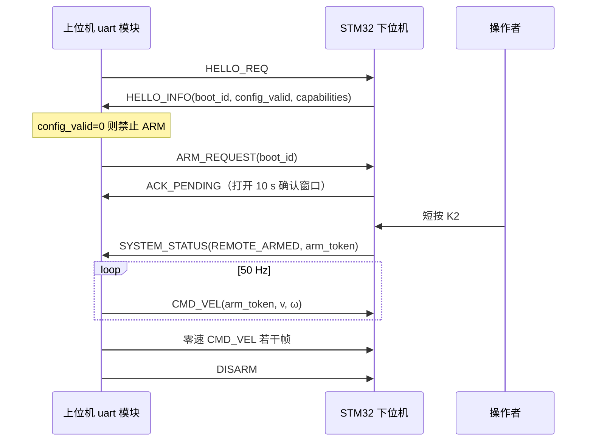

# 下位机串口通信契约（上位机侧）

## Contents

- [Overview](#overview)
- [物理链路](#物理链路)
- [串口设置](#串口设置)
- [线协议](#线协议)
- [会话流程](#会话流程)
- [上位机侧行为约定](#上位机侧行为约定)
- [错误处理与重连](#错误处理与重连)
- [Testing](#testing)

## Overview

本文描述上位机（香橙派 RK3588）与 STM32H743 下位机之间串口通信在**上位机这一侧**的实现约定：设备节点、termios 参数、会话状态机、周期性任务、超时与重连策略。

线协议本身（帧格式、消息 ID、字段偏移、CRC 参数、黄金测试向量）以下位机仓库的 `UART_PROTOCOL.md` 为**唯一权威**，本文不重复抄录，只在需要说明上位机责任时引用其中的字段名。协议变更由双方在 `UART_PROTOCOL.md` 同步，然后各自更新实现。

实现该契约的模块是 `uart/`，模块文档见 `docs/reference/comm/uart.md`。

## 物理链路

杜邦线直连，三根线：香橙派 40 针的 UART TX 接 STM32 的 PD9（USART3_RX），香橙派的 UART RX 接 STM32 的 PD8（USART3_TX），两侧 GND 必须相连。TX/RX 交叉是必须的，共地不接会导致电平参考漂移、收到大量 CRC 错误。

双方都是 3.3 V TTL。禁止把 STM32 的 PD8/PD9 接到 5 V TTL 模块的 TX 或原生 RS-232 电平上，后者的正负电压会损坏 MCU。

香橙派侧具体启用哪一路 UART、对应的物理针脚编号和设备节点名尚未确定：当前系统里没有任何 `/dev/ttyS*`，说明 40 针的 UART overlay 还没开启。需要查 Orange Pi 5 Plus 的针脚定义，在 `/boot/orangepiEnv.txt` 的 `overlays=` 中加入对应的 uart overlay 并重启，运行程序的用户还要加入 `dialout` 组才有读写权限。设备节点名写在配置里，不硬编码在代码中。

## 串口设置

以 raw 模式打开，921600 8N1，无校验位，无硬件流控，无软件流控（关闭 `IXON`/`IXOFF`），关闭所有 CR/LF 转换（清 `ICRNL`/`INLCR`/`ONLCR`/`OPOST`），关闭规范模式与回显（清 `ICANON`/`ECHO`/`ISIG`）。协议是二进制的，任何字节改写都会破坏 COBS 分帧和 CRC。

读取用非阻塞或短超时轮询：`VMIN = 0`、`VTIME = 1`（100 ms 上限），配合 `poll()` 等待可读，避免忙等占满一个核心。写入按整帧一次性 `write()`，短写要循环补齐。

`921600` 在 Linux 上是标准波特率常量，`cfsetispeed`/`cfsetospeed` 可直接设置，不需要 `BOTHER` 特殊路径。

## 线协议

一帧是 `COBS(帧头 || payload || CRC32C) || 0x00`。帧头 18 字节，含魔数 `0xA55A`、协议主版本、消息 ID、flags、reserved、16 位序号、payload 长度和发送方单调微秒时间戳。CRC 为 CRC-32C（Castagnoli，反射多项式 `0x82F63B78`，初值与终值异或均为全 `1`），覆盖未编码的帧头与 payload，小端写入帧尾。所有多字节整数小端，浮点为 IEEE-754 binary32。

字段级细节见 `UART_PROTOCOL.md` 第 3 至第 6 节。上位机需要处理的消息：下发方向 `HELLO_REQ`、`TIME_SYNC_REQ`、`ARM_REQUEST`、`DISARM`、`CMD_VEL`、`RESET_ODOM`、`CLEAR_FAULT_REQUEST`；接收方向 `ACK`、`HELLO_INFO`、`TIME_SYNC_RESP`、`ODOM_STATE`、`IMU_STATE`、`IMU_DEBUG`、`SYSTEM_STATUS`、`FAULT_EVENT`。

序列化必须逐字节写入，**不允许**把 C++ 结构体直接 `memcpy` 上线——对齐、填充和 ABI 差异会让两端字节布局不一致。

## 会话流程

ARM 必须有操作者现场按键确认，上位机无法单方面使能。`config_valid=0`（下位机电机/编码器未绑定或底盘参数为零）时不得发起 ARM，重发或伪造 token 绕过安全检查是被明确禁止的。

## 上位机侧行为约定

**建链**：启动后发 `HELLO_REQ`，保存本次 `boot_id` 与 `capabilities`。`boot_id` 变化意味着下位机复位或重新上电，必须立即丢弃 token 与全部控制状态，重新走建链与 ARM 流程。

**速度下发**：进入 ARMED 后以 50 Hz 恒定发送 `CMD_VEL`，即使目标速度为零也要发。周期由独立线程用 `steady_clock` 维护并补偿抖动，不依赖 Qt 事件循环。上层（state 模块）给出的速度指令带本地有效期，超期后本模块自动改发零速而不是保持旧值——下位机 250 ms 无有效命令就会安全停车并锁存 `FAULT_COMM_TIMEOUT`。

**输入校验**：下发前拒绝 NaN 与 Inf，并按整车上限裁剪线速度与角速度。上位机的裁剪不替代下位机的 token 校验和看门狗，只是减少无效帧。

**正常停车**：先连续发若干帧零速 `CMD_VEL`，再发 `DISARM`。进程退出、串口异常或上层请求停止时都要尽力走完这个序列。

**时间同步**：按需以 1–10 Hz 发 `TIME_SYNC_REQ`，用 NTP 风格的四时间戳（`t1` 本地发送、`t2`/`t3` 来自响应、`t4` 本地接收）估计下位机微秒时钟到本地时钟的偏移，过滤往返时延偏大的样本。遥测数据的时间戳用同步后的采样时刻，不能用接收时刻简单替代。

**里程计归属**：权威平面里程计只取 `ODOM_STATE`，并检查其 `VALID` 状态位。`IMU_DEBUG` 里的加速度积分带 `NOT_FOR_NAVIGATION` 标志，仅供漂移观察，禁止进入导航或控制链路。`IMU_STATE` 的姿态在校准完成（`CALIBRATED` 位置起）前视为未就绪。

**诊断上报**：把 CRC 错误、格式错误、溢出、通信超时、下位机故障码与降级状态暴露给 UI 与状态机，不要静默丢弃。

## 错误处理与重连

以 `0x00` 作为帧边界逐字节收帧，不依赖读取块的边界。COBS 解码失败、长度不等于 `18 + payload_length + 4`、魔数或版本不符都计入格式错误并丢弃；CRC 不匹配计入 CRC 错误并静默丢弃。坏帧中的 token、速度和时间戳一律不得沿用。

编码缓冲溢出时丢弃到下一个 `0x00` 重新同步。串口读写返回错误或设备消失时关闭并按退避策略重开，重开后必须重新 `HELLO_REQ`——重连不会恢复旧 token。

超过约 1 s 没收到任何有效帧时，把本地链路状态置为断开并通知上层。清故障需要下位机侧长按 K2，上位机的 `CLEAR_FAULT_REQUEST` 只表达意图，不会绕过现场确认。

对 `ACK` 用 `request_sequence` 与 `request_type` 配对响应，重试次数要设上限，避免无限重发管理命令。

## Testing

编解码与会话逻辑全部要求无硬件可测：传输层背后换成内存 fake，时钟可注入。

最关键的一组用例来自 `UART_PROTOCOL.md` 第 10 节的黄金测试向量——`HELLO_REQ`、零速 `CMD_VEL` 两条帧要能字节级复现，第三条故意保留旧 CRC 的坏帧必须被判为 CRC 错误且不产生任何副作用。CRC 实现用 `123456789` 校验值 `0xE3069283` 自检。

具体测试清单与结果记录在 `docs/reference/comm/uart.md` 的 Testing 一节。

**Related**：[总体架构](../architecture/overview.md) · [uart 模块文档](../reference/comm/uart.md)
