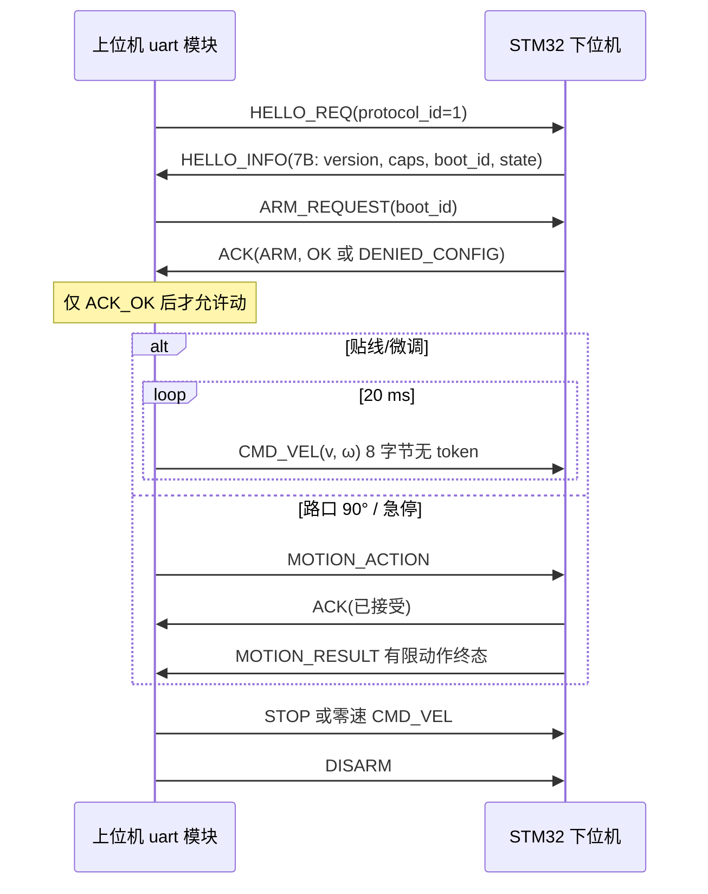

# 下位机串口通信契约（上位机侧）

## Contents

- [Overview](#overview)
- [物理链路](#物理链路)
- [串口设置](#串口设置)
- [线协议](#线协议)
- [会话流程](#会话流程)
- [上位机侧行为约定](#上位机侧行为约定)
- [错误处理与重连](#错误处理与重连)
- [Testing](#testing)

## Overview

本文描述上位机（香橙派 RK3588）与 STM32H743 下位机之间串口通信在**上位机这一侧**的实现约定：设备节点、termios 参数、会话状态机、周期性任务、超时与重连策略。

线协议本身（帧格式、消息 ID、字段偏移、CRC 参数、黄金测试向量）以下位机仓库的 `UART_PROTOCOL.md` 为**唯一权威**，本文不重复抄录，只在需要说明上位机责任时引用其中的字段名。协议变更由双方在 `UART_PROTOCOL.md` 同步，然后各自更新实现。

实现该契约的模块是 `uart/`，模块文档见 `docs/reference/comm/uart.md`。

## 物理链路

杜邦线直连，三根线：香橙派 40 针的 UART TX 接 STM32 的 PD6（USART2_RX），香橙派的 UART RX 接 STM32 的 PD5（USART2_TX），两侧 GND 必须相连。TX/RX 交叉是必须的，共地不接会导致电平参考漂移、收到大量 CRC 错误。USART3（PD8/PD9）仅在下位机初始化，不承载 ROS 协议。

双方都是 3.3 V TTL。禁止把 STM32 的 PD5/PD6 接到 5 V TTL 模块的 TX 或原生 RS-232 电平上，后者的正负电压会损坏 MCU。

香橙派侧具体启用哪一路 UART、对应的物理针脚编号和设备节点名尚未确定：当前系统里没有任何 `/dev/ttyS*`，说明 40 针的 UART overlay 还没开启。需要查 Orange Pi 5 Plus 的针脚定义，在 `/boot/orangepiEnv.txt` 的 `overlays=` 中加入对应的 uart overlay 并重启，运行程序的用户还要加入 `dialout` 组才有读写权限。设备节点名写在配置里，不硬编码在代码中。

## 串口设置

以 raw 模式打开，921600 8N1，无校验位，无硬件流控，无软件流控（关闭 `IXON`/`IXOFF`），关闭所有 CR/LF 转换（清 `ICRNL`/`INLCR`/`ONLCR`/`OPOST`），关闭规范模式与回显（清 `ICANON`/`ECHO`/`ISIG`）。协议是二进制的，任何字节改写都会破坏分帧和 CRC。

读取用非阻塞或短超时轮询：`VMIN = 0`、`VTIME = 1`（100 ms 上限），配合 `poll()` 等待可读，避免忙等占满一个核心。写入按整帧一次性 `write()`，短写要循环补齐。

`921600` 在 Linux 上是标准波特率常量，`cfsetispeed`/`cfsetospeed` 可直接设置，不需要 `BOTHER` 特殊路径。

## 线协议

当前协议标识为 **1**（固件 v1.2.22）。一帧是 `55 AA | TYPE | LENGTH | PAYLOAD | CRC8`，总长 `LENGTH + 5`。`LENGTH` 只算 payload，上限 128。CRC 为 CRC-8/ATM（多项式 `0x07`，初值 `0x00`，输入输出均不反射，最终不异或，检查值 `CRC8("123456789") = 0xF4`），覆盖 `TYPE + LENGTH + PAYLOAD`，同步字不参与计算。所有多字节整数小端，浮点为 IEEE-754 binary32。HELLO 黄金帧为 `55 AA 01 01 01 79`，零速 `CMD_VEL` 为 `55 AA 12 08 00 00 00 00 00 00 00 00 83`。

payload 里可以出现任意字节（包括 `55 AA`），接收端必须严格按 `LENGTH` 取数据。协议标识在 `HELLO_REQ` 的 payload 里。

字段级细节见下位机 `UART_PROTOCOL.md` / `UART_MESSAGES.md`。上位机需要处理的消息：下发 `HELLO_REQ`、`ARM_REQUEST`、`DISARM`、`CMD_VEL`、`MOTION_ACTION`；接收 `ACK`、`HELLO_INFO`、`ODOM_STATE`、`IMU_STATE`、`IMU_DEBUG`、`SYSTEM_STATUS`、`MOTION_RESULT`。

序列化必须逐字节写入，**不允许**把 C++ 结构体直接 `memcpy` 上线——对齐、填充和 ABI 差异会让两端字节布局不一致。

## 会话流程

```mermaid
sequenceDiagram
  participant U as 上位机 uart 模块
  participant M as STM32 下位机
  U->>M: HELLO_REQ(protocol_id=1)
  M->>U: HELLO_INFO(7B: version, caps, boot_id, state)
  U->>M: ARM_REQUEST(boot_id)
  M->>U: ACK(ARM, OK 或 DENIED_CONFIG)
  Note over U: 仅 ACK_OK 后才允许动
  alt 贴线/微调
    loop 20 ms
      U->>M: CMD_VEL(v, ω) 8 字节无 token
    end
  else 路口 90° / 急停
    U->>M: MOTION_ACTION
    M->>U: ACK(已接受)
    M->>U: MOTION_RESULT 有限动作终态
  end
  U->>M: STOP 或零速 CMD_VEL
  U->>M: DISARM
```

不再需要 K2 解锁，也没有 `arm_token`。是否允许运动以 `ARM_REQUEST` 的 ACK 为准：`ACK_OK` 才能发 `CMD_VEL` / `MOTION_ACTION`，`ACK_DENIED_CONFIG` 表示硬件或机械参数无效。两种运动命令互斥：有限动作未收到 `0x94` 时不得切速度环；`STOP` 随时可发。

## 上位机侧行为约定

**建链**：启动后发 `HELLO_REQ(1)`，保存本次 `boot_id` 与 `capabilities`。`boot_id` 变化意味着下位机复位，必须丢掉 ARM 成功标志与运动状态，重新 HELLO 再 ARM。

**速度下发**：`ARM` 成功且处于速度环时按 20 ms 发 8 字节 `CMD_VEL`。上层指令带本地有效期，超期改发零速。下位机**没有** 250 ms 断流看门狗，香橙派卡死时车可能继续跑，因此丢线、退出、丢线必须主动 `STOP`/`DISARM`。

**动作下发**：路口 90° 用 `MOTION_ACTION` 3/4，等 `MOTION_RESULT`；超时不得当成功，也不得自动重发。急停用 action=0，不受有限动作等待限制。长直道、贴线、倒车、90° 落地后的航向微调都走 `CMD_VEL`，不要用前进锁航向动作替代寻线。

**输入校验**：拒绝 NaN 与 Inf。

**正常停车**：速度环先连发若干帧零速再 `DISARM`；动作环先 `STOP` 再 `DISARM`。

**里程计归属**：权威平面里程计只取 `ODOM_STATE`，并检查其 `VALID` 状态位。`IMU_DEBUG` 里的加速度积分带 `NOT_FOR_NAVIGATION` 标志，仅供漂移观察，禁止进入导航或控制链路。`IMU_STATE` 的姿态在校准完成（`CALIBRATED` 位置起）前视为未就绪。

**航向归属**：ICM42688 无磁力计，`relative_yaw_rad` 是上电后的相对角，会漂。uart **不**融合视觉、**不**向下位机写 yaw（协议无此消息）。相对路面的朝向由 `navigation` 在 Pi 上用中心线 / IPM 切线维护 `yaw_offset`，见 [`docs/nav.md`](../nav.md)「运动通道与航向校准」。`IMU_STATE` 只给导航当短窗口相对角的底数。

**诊断上报**：把 CRC 错误、格式错误、溢出、通信超时、下位机故障码与降级状态暴露给 UI 与状态机，不要静默丢弃。

## 错误处理与重连

用六状态机（等 `0x55`、等 `0xAA`、读 TYPE、读 LENGTH、读 PAYLOAD、读 CRC）逐字节收帧，不依赖读取块的边界。`LENGTH > 128` 计入溢出并重新搜索 `55 AA`；CRC 不匹配计入 CRC 错误并静默丢弃。坏帧中的速度与动作一律不得沿用。

帧收到一半断流超过 **20 ms**（字节间超时，与固件的 `CAR_PROTOCOL_INTERBYTE_TIMEOUT_US` 一致）时必须丢弃残帧。不做这一步的话，残帧会与后续字节拼出长度和内容都错位、但 CRC 恰好自洽的"合法"帧。

串口读写返回错误或设备消失时关闭并按退避策略重开，重开后必须重新 `HELLO_REQ` 与 `ARM_REQUEST`。

超过约 1 s 没收到任何有效帧时，把本地链路状态置为断开并通知上层。清故障仍由下位机侧长按 K2。

**ACK 配对**：没有序号，`ACK` 只能按 `request_type` 配对。同一时刻只允许一个在途管理请求（含非 STOP 的 `MOTION_ACTION`）。超时只释放名额，不自动重发。`HELLO_REQ` 幂等且由 `HELLO_INFO` 回应，不占名额。`DISARM` 与 `STOP` 不受名额限制。

## Testing

编解码与会话逻辑全部要求无硬件可测：传输层背后换成内存 fake，时钟可注入。

最关键的一组用例来自固件黄金帧——`55 AA 01 01 01 79`（`HELLO_REQ`）和零速 `CMD_VEL` `55 AA 12 08 … 83` 要能字节级复现；故意保留旧 CRC 的坏帧必须被判为 CRC 错误且不产生任何副作用。CRC 实现用 `CRC8("123456789") = 0xF4` 自检。

具体测试清单与结果记录在 `docs/reference/comm/uart.md` 的 Testing 一节。

**Related**：[总体架构](../architecture/overview.md) · [uart 模块文档](../reference/comm/uart.md) · [导航航向校准](../nav.md)
