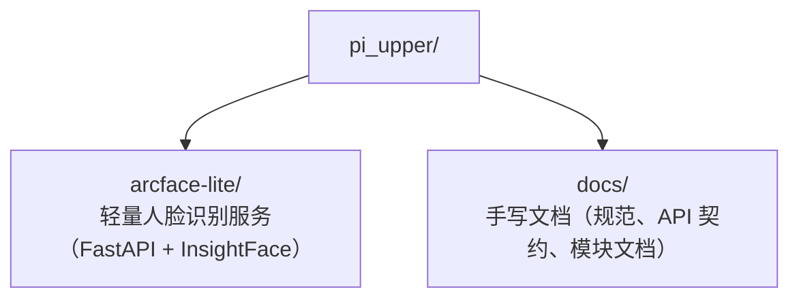

# Repository Layout

`pi_upper` 是香橙派上位机仓库，按"一个文件夹一个关注点"组织：每个可独立运行的模块一个顶层文件夹，文档集中在 `docs/`。

当前顶层目录：

`arcface-lite/` — 人脸识别服务与测试客户端，模块文档见 `docs/reference/perception/arcface-lite.md`，上手步骤见其 `README.md`。

`docs/` — 手写文档，文档地图见 `docs/doc_layout.md`。

后续新增的代码模块归属上位机 C++/Qt 单体工程，物理目录结构随骨架搭建时确定并更新本文；独立服务（如 arcface-lite）仍保持顶层独立文件夹，并按 `docs/conventions.md` 的要求在 `docs/reference/<layer>/` 下补一篇模块文档。
