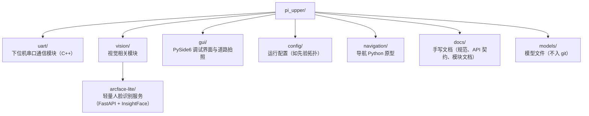

# Repository Layout

`pi_upper` 是香橙派上位机仓库，按"一个文件夹一个关注点"组织：每个可独立运行的模块一个顶层文件夹，文档集中在 `docs/`。

当前顶层目录：

`config/` — 运行时加载的配置（非文档）。当前含赛题图 3 先验拓扑 `config/nav_topology.yaml`；设计说明见 `docs/nav.md`，目录说明见 `config/README.md`。

`navigation/` — 导航 Python 原型。`topo_proto/` 加载拓扑 YAML 并做 Dijkstra / 模拟封边；见 `navigation/README.md` 与 `docs/reference/navigation/topo_proto.md`。

`uart/` — 与 STM32 下位机的串口通信模块，内部分 `proto/`（纯协议编解码）与 `link/`（串口、时钟、会话状态机）两层。模块文档见 `docs/reference/comm/uart.md`，线协议见下位机仓库的 `UART_PROTOCOL.md`，上位机侧实现约定见 `docs/api/uart.md`。

`vision/arcface-lite/` — 人脸识别服务与测试客户端，模块文档见 `docs/reference/perception/arcface-lite.md`，上手步骤见其 `README.md`。

`gui/` — 现阶段 Python / PySide6 调试界面：双路 UVC 预览、逻辑摄像头映射、V4L2 调参，以及道路分割训练用的原始帧拍照（写入 `data/road/`）。上手说明见 `gui/README.md`。任务拓扑与界面应暴露的策略字段见 `docs/superpowers/specs/2026-09-02-mission-topology-and-gui-design.md`。

`docs/` — 手写文档，文档地图见 `docs/doc_layout.md`。

`models/` — 模型文件（RKNN/ONNX），体积大不入库，各机器自行准备。

后续新增的代码模块归属上位机 C++/Qt 单体工程，物理目录结构随骨架搭建时确定并更新本文；视觉类独立服务归入 `vision/`（如 arcface-lite），并按 `docs/conventions.md` 的要求在 `docs/reference/<layer>/` 下补一篇模块文档。
