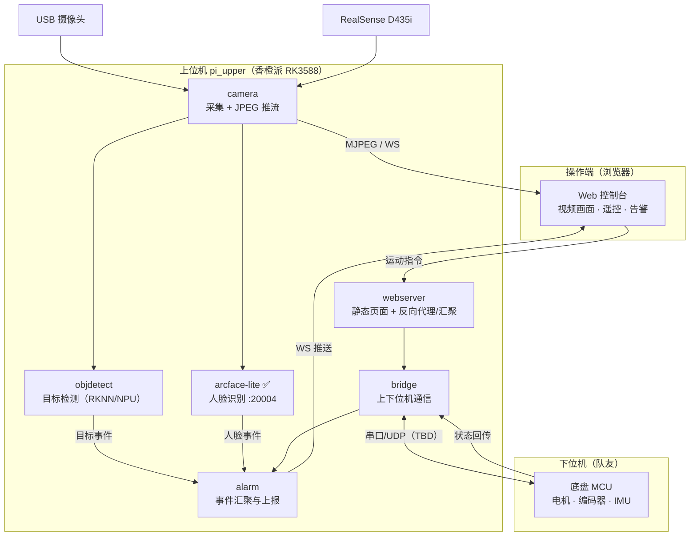

# 上位机总体架构（规划）

杭州侦察机器人 —— 上位机（香橙派 RK3588）侧的模块划分、通信边界与开发顺序。本文是规划稿，标注 **TBD** 的条目需要对照任务书或与下位机队友确认后修订。

## Contents

- [系统定位](#系统定位)
- [总体架构](#总体架构)
- [模块划分](#模块划分)
- [通信契约](#通信契约)
- [技术选型](#技术选型)
- [开发顺序](#开发顺序)
- [待确认项](#待确认项)

## 系统定位

上位机负责"看、认、报、控"：采集相机画面，跑 AI 推理（目标检测、人脸识别），把告警与画面上报给操作端，并把操作端的指令转发给下位机。所有需要算力的任务集中在上位机；下位机（队友负责）只管底盘运动与本体的实时控制，双方通过串口/网口交换精简指令。

设计取向沿用 arcface-lite 已验证的路线：**无 ROS 依赖的独立微服务**，进程间用 HTTP/WebSocket 通信，每个模块可单独启动、单独测试。这让上位机任意模块挂了不影响其他模块，也让队友复刻环境时不用装 ROS。

## 总体架构

## 模块划分

每个模块是 `pi_upper/` 下的一个顶层文件夹，独立进程、独立端口，配一篇 `docs/reference/<layer>/<module>.md`。

`arcface-lite/`（已有）— 人脸识别服务，HTTP + WebSocket，端口 20004。侦察场景中负责"认出库里的人"，其余人脸报 Unknown。

`camera/` — 视频采集与推流。统一接管 USB 摄像头与 D435i，对内提供取帧接口（供检测/识别服务消费），对外提供 MJPEG over HTTP 或 WebSocket 图传给 Web 控制台。把"相机在哪台机器上"这件事对上层屏蔽掉。

`objdetect/` — 目标检测服务。侦察的核心感知，检测人/车辆/特定目标物（类别集合 TBD，取决于任务书），输出类别 + bbox + 置信度。模型文件放 `models/`（大文件不入 git）。

`bridge/` — 上下位机通信桥。把 Web 控制台的运动指令（前进/转向/速度）翻译成下位机帧协议下发；把下位机回传的状态（电量、里程、故障码）解析后转 WebSocket 上报。协议格式与队友共同定义，定义后写成 `docs/api/` 下的契约文档。

`alarm/` — 事件汇聚。订阅检测/识别/下位机的事件流，做去抖与优先级合并（同一人 3 秒内只报一次之类），统一推给 Web 控制台并落盘事件日志。

`webserver/` + `webui/` — Web 控制台后端与前端。视频画面、遥控面板、告警列表三合一；前端可参考 Radish 的 `webui/`（Vite + TS SPA）裁剪重建。

`models/` — 模型文件统一存放处（RKNN/ONNX），体积大不入库，各机器自行准备，README 记录每个模型的来源与版本。

## 通信契约

操作端 ↔ 上位机：HTTP REST + WebSocket，风格与 `docs/api/face.md` 一致（统一信封 `{status, message, data}`）。图传走独立通道（MJPEG 流或二进制 WS 帧），不进信封。

上位机内部服务之间：摄像头帧与识别结果走 WebSocket 二进制帧（沿用 arcface-lite `/ws/recognize` 的模式：JPEG 进、JSON 出）。事件上报走 WebSocket JSON。

上位机 ↔ 下位机：下位机为 STM32（IMU 用 ICM42688，由下位机队友负责）。物理链路用一对 **DAPLink 无线串口模块**做透传：香橙派侧 USB 插入识别为 `/dev/ttyACM*`（CDC ACM 免驱），STM32 侧接 UART（TX/RX 交叉、共地、3.3V 电平）。模块配对方式（点对点 vs WiFi AP 模式）需到手实测确认。

协议为串口定长帧：`帧头 0xAA55 | 指令字 | 长度 | 数据 | CRC8`。无线链路有丢包，必须带 CRC 校验、心跳与超时重连；图像不走串口。协议预留"姿态上报"指令字，让 STM32 把 ICM42688 解算的俯仰/偏航角转发给控制台显示。双方各维护一份协议文档，改协议两边同步更新。

## 技术选型

推理加速：RK3588 自带 6 TOPS NPU，`objdetect` 用 **RKNN-Toolkit-Lite2** 部署自训的 YOLO 量化模型。训练链路：4070Ti 主机训练 YOLOv8 → 导出 ONNX → 主机上 RKNN-Toolkit2 量化转换 → `.rknn` 放入 `models/` → 板端加载推理。arcface-lite 继续用 onnxruntime CPU（已验证够用，不与 NPU 抢资源）。

不引入 ROS 2：模块少、团队人手紧，微服务架构的运维成本低于 ROS；若后期需要 SLAM/导航再评估（Nav2 是唯一值得引入 ROS 的理由）。

图传先用 MJPEG over HTTP：实现半天、浏览器原生支持、局域网内延迟可接受；若任务书对延迟/帧率有硬指标再升级 WebRTC。

语言：AI 服务与桥接用 Python 3.10（与 arcface-lite 一致）；Web 前端 TypeScript。

## 开发顺序

1. **bridge + 协议约定**——和队友把上下位机协议定下来，先让控制台能遥控车动起来（最小闭环）。
2. **camera + webui 画面**——操作端能看到实时画面，侦察的基本形态就有了。
3. **objdetect**——接入检测模型，画面叠加识别框，事件进 alarm。
4. **arcface-lite 接入 alarm**——特定人员告警（服务现成，只差事件接线和 Web 展示）。
5. **完善**：事件日志、录像/截图存证、电量显示等，按任务书评分点排优先级。

每一步交付都遵循 `docs/conventions.md`：代码 + 模块文档 + API 契约同一个 commit。

## 待确认项

对照任务书/与队友对齐后修订本文：

- 比赛任务与评分点：侦察目标是什么（人？特定物体？二维码/文字？）、有无自主巡检/避障要求、有无时间限制。
- 车体传感器清单：除 D435i、USB 摄像头外是否有雷达、麦克风、扬声器（IMU 已确认为 ICM42688，在下位机）。
- DAPLink 无线串口模块的配对模式（点对点透传 vs WiFi AP），到手后实测确认。
- 操作端形态：浏览器控制台是否符合规则，还是要求指定平台/上位机软件。
- ~~语音形态~~ 已确认不做 ASR（题目无语音交互需求）。仅当任务书要求喊话/警示音时再评估音频下行或 Piper TTS，优先级最低。
- 自训检测模型的目标类别集合与数据采集/标注分工。
