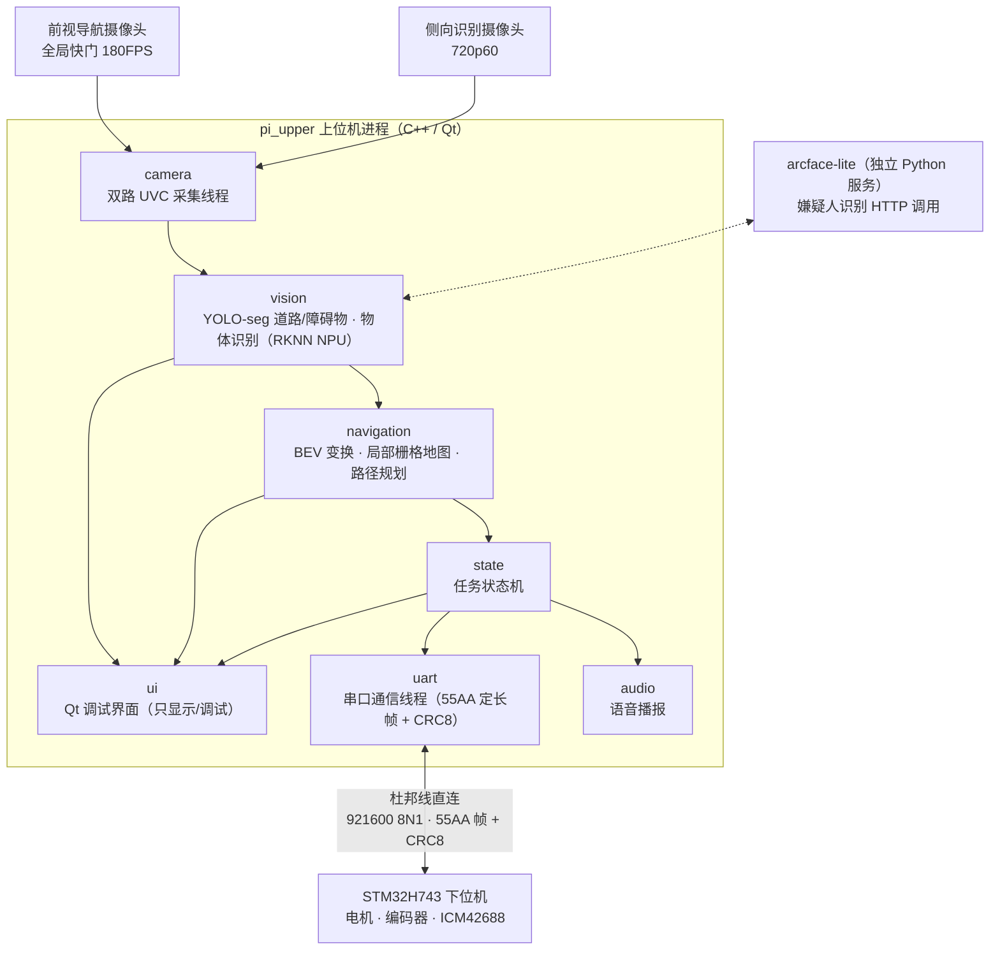

# 上位机总体架构（规划）

杭州侦察机器人 —— 上位机（香橙派 Orange Pi 5 Plus / RK3588）侧的模块划分、通信边界与开发顺序。本文是规划稿，标注 **TBD** 的条目需要对照任务书或与下位机队友确认后修订。

## Contents

- [系统定位](#系统定位)
- [总体架构](#总体架构)
- [模块划分](#模块划分)
- [通信契约](#通信契约)
- [技术选型](#技术选型)
- [开发顺序](#开发顺序)
- [待确认项](#待确认项)

## 系统定位

上位机负责"看、认、报、控"：采集两路相机画面，跑 AI 推理（道路分割、障碍物/物体检测、人脸识别），做视觉导航与局部路径规划，通过 Qt 调试界面呈现状态，并经串口与 STM32 下位机交换指令与状态。

技术路线：**纯 C++ / Qt 单体应用，不使用 ROS**。采集、推理、规划、通信各自跑在独立线程，Qt 只做显示与调试，不参与核心控制逻辑。唯一的例外是 `vision/arcface-lite/`（已有的 Python 人脸识别服务）：现阶段作为独立进程保留，C++ 侧通过 HTTP 调用；待 YOLO 链路打通后再评估是否用 RKNN 重写并入视觉模块。

## 总体架构

线程模型：相机采集、推理、规划、串口各一条线程，UI 跑主线程；跨线程通信用 Qt 信号槽（QueuedConnection）或线程安全队列，帧数据只传指针/索引不拷贝。

## 模块划分

逻辑模块如下（物理目录结构随骨架搭建时再定，不提前锁死）：

`ui` — Qt 调试界面。显示两路画面与识别叠加、BEV 地图与规划轨迹、状态机当前状态、下位机回传的姿态/速度/电量，提供手动遥控与调试按钮。只做显示和调试入口。

`camera` — 双路 UVC 采集。前视导航相机（全局快门，优先 1280×720 高帧率）与侧向识别相机（MJPG 720p60）各自独立线程，对内发布帧。

`vision` — 视觉识别。YOLO-seg 道路分割与障碍物识别（RKNN）、物体识别（RKNN）；嫌疑人脸识别现阶段调用 arcface-lite 的 HTTP 接口。输出语义结果（车道区域、障碍物框、目标类别、bbox）。

`navigation` — 视觉导航。BEV 鸟瞰变换、局部栅格地图生成、局部路径规划，输出期望速度/角速度给状态机。

`state` — 任务状态机。按比赛流程串联各阶段（启动、巡航、识别、告警、返航等，具体状态集合 TBD，随任务书定稿），仲裁手动遥控与自主导航的指令来源。

`uart` — 串口通信。定长字段分帧、CRC8 校验、消息编解码、会话与 ARM 状态机、50 Hz 速度下发与遥测解析。传输层抽象成 `Transport` 接口，串口实现之外提供内存 fake，便于无硬件单测。

`audio` — 语音播报。预录音频文件播放为主（`aplay` 或 Qt Multimedia）；任务书若要求动态播报再叠 Piper TTS。

`vision/arcface-lite/`（仓库内已有）— 独立 Python 人脸识别服务，HTTP/WebSocket 接口已文档化（见 `docs/api/face.md`）。

## 通信契约

进程内模块之间：C++ 接口直调 + Qt 信号槽跨线程；图像帧用带时间戳的共享帧缓冲（读最新、写加锁），避免每帧拷贝。

上位机 ↔ 下位机：下位机为 STM32H743VIT6（IMU 用 ICM42688，姿态解算在下位机完成）。物理链路是杜邦线直连——香橙派 40 针的 UART TX/RX/GND 对接 STM32 的 USART3（PD9 收、PD8 发），TX/RX 交叉、必须共地、双方都是 3.3 V TTL，不得接入 5 V 或 RS-232 电平。串口参数 921600 8N1，无流控。

协议以下位机仓库的 `RC/UART_PROTOCOL.md` 为唯一权威，当前版本为 2：`55 AA | TYPE | LENGTH | PAYLOAD | CRC8`，`LENGTH` 上限 128，CRC-8/ATM 覆盖 `TYPE + LENGTH + PAYLOAD`。没有 COBS、结束符、序号和通用时间戳，payload 里允许出现同步字，接收端严格按长度定帧。安全模型由下位机主导——上位机先 `HELLO_REQ` 取 `boot_id`，`config_valid=1` 才允许发起 `ARM_REQUEST`，操作者现场短按 K2 确认后上位机从 `SYSTEM_STATUS` 读到 `arm_token`，随后必须以 50 Hz 持续发送带 token 的 `CMD_VEL`（零速也要发）；超过 250 ms 没有有效命令下位机立即安全停车并锁存通信故障。遥测方向按 `ODOM_STATE` 50 Hz、`IMU_STATE` 200 Hz、`SYSTEM_STATUS` 10 Hz 上报，故障以 `FAULT_EVENT` 事件推送。

上位机侧的实现约定（设备路径、termios 设置、会话状态机、重连与超时策略）写在 `docs/api/uart.md`，不重抄线协议细节。协议本身的任何改动由双方在 `RC/UART_PROTOCOL.md` 同步。

## 技术选型

语言与框架：C++17，Qt（Widgets 起步够用，调试界面不必上 QML）。构建用 CMake。格式化用 clang-format（Google 风格，100 列），仓库根提交 `.clang-format`。

视觉：OpenCV 负责采集与图像处理；YOLO-seg / 检测模型在训练主机上训练，ONNX 导出后经 RKNN-Toolkit2 量化，板端用 RKNN Runtime C++ API（librknnrt）推理，NPU 独占给 vision 模块。人脸识别继续沿用 arcface-lite（onnxruntime CPU），不与 NPU 抢资源。

串口：POSIX termios 以 raw 方式直读 `/dev/ttyS*`，不引入 Qt SerialPort，避免通信层依赖 Qt 事件循环。协议栈与传输层分离，传输层背后可以是真实串口或内存 fake，保证编解码和会话逻辑能脱离硬件单测。

50 Hz 的 `CMD_VEL` 下发跑在独立线程里，用 `steady_clock` 自行补偿周期，不挂在 Qt 事件循环上——Linux 非实时，事件循环抖动容易踩下位机 250 ms 的命令看门狗。

不引入 ROS 2：题目规模下 ROS 的构建与运维成本大于收益；Qt 自带线程与信号槽足以支撑本架构。下位机仓库的文档里假定上位机跑 ROS 2 Humble 并实现一个串口桥接节点，但协议本身不依赖 ROS，纯 C++ 实现等价，这一点需要与下位机队友对齐说法。

## 开发顺序

1. **uart**——协议已由下位机定稿，按 `RC/UART_PROTOCOL.md` 自底向上实现 CRC8、帧编解码、消息编解码、会话状态机，用协议里的黄金帧做无硬件单测，接线后即可联调建链与遥测。
2. **camera + ui 出图**——双路采集跑通，Qt 界面能看到两路画面，帧率达标。
3. **vision 第一刀**——先在 PC 上训练/转换一个检测模型，板端 RKNN 推理出框，叠加到画面。
4. **navigation**——BEV + 栅格地图 + 局部规划，仿真数据先行，再接真实相机。
5. **state 状态机 + 人脸告警**——串起比赛流程；arcface-lite 接入识别嫌疑人事件。
6. **完善**：语音播报、事件日志、截图存证等，按任务书评分点排优先级。

每一步交付遵循 `docs/conventions.md`：代码 + 模块文档 + 必要的契约文档同一个 commit。

## 待确认项

对照任务书/与队友对齐后修订本文：

- 比赛任务与评分点：场地形态、道路/障碍物规格、识别目标类别、有无自主与遥控的模式要求、时间限制——直接决定 `state` 状态机的状态集合与 `vision` 的类别表。
- 香橙派 40 针上具体启用哪一路 UART、对应的物理针脚编号和设备节点名（`/dev/ttyS*`）。当前系统里没有任何 `/dev/ttyS*`，说明 UART overlay 还没开启，需要查 Orange Pi 5 Plus 的针脚定义后在 `/boot/orangepiEnv.txt` 里加 overlay 并重启，运行用户还要加入 `dialout` 组。实际接线前不阻塞代码开发。
- 下位机的电机、编码器引脚和底盘机械参数尚未绑定，固件当前上报 `config_valid=0` 并拒绝 ARM。联调初期只能验证建链、时间同步和遥测解析，运动控制要等对方补齐参数。
- 自训模型的目标类别集合与数据采集/标注分工（训练在 4070Ti 主机上进行）。
- 除双 USB 摄像头外是否还有雷达等传感器接入上位机。
