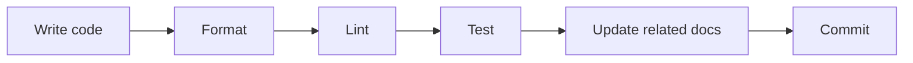
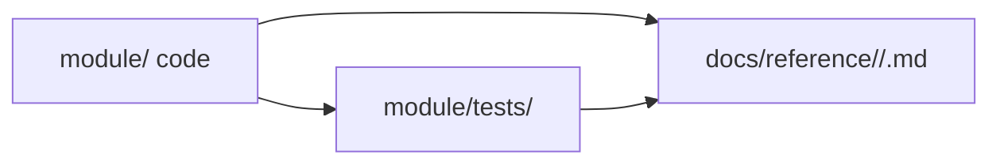

# Coding Conventions

General coding conventions and practices. Adapt paths, tooling, and optional sections to each repository.



When a module-specific note under `docs/` conflicts with this file, the module doc wins for that folder only.

---

## Inline documentation (functions and types)

Every **public** item carries a short note so readers (and doc generators) understand intent without opening the body. Notes can be **simple and brief** — one line is fine when the name is clear. They must still cover anything non-obvious: important **design** choices, **usage** constraints, caller responsibilities, units, error behavior, or invariants that are not visible from the signature alone.

Code notes live next to the symbol in source; product docs live in `docs/`.

### What to document

**Always:** package/module/file header (purpose, boundaries, what *not* to put here), public types, public functions/methods, unsafe code (invariants the caller must uphold).

**When not obvious:** public fields (units, invariants), private items that are easy to misuse.

**Write for the reader who did not write the code.** Prefer *why*, *design*, and *contracts* over restating the implementation. Good notes answer **role** (what is this?), **contract** (inputs, outputs, errors, panics, timeouts), **units** (meters vs pixels, 0- vs 1-based indices), **lifecycle** (ownership, validity, idempotency), and **boundaries** (which module owns the type). Skip length when a single sentence is enough; add detail only where misuse would be costly.

Skip notes that repeat the identifier; fix notes that no longer match the code.

### Rust

`///` on items; `//!` for module/crate prose at top of file. First line is a one-sentence summary. Link types with `` [`TypeName`] ``; use `# Errors` for fallible APIs; note complexity or lock scope when relevant.

```rust
//! Filesystem-backed document store. Accepts only `.md` and `.pdf`.

/// Anchor location for inline comments in Markdown docs.
///
/// `line` is 1-indexed. `word_range` is an inclusive character span on that line.
pub struct InlineAnchor {
  pub line: u32,
}

/// World center (x, y in meters) → top-down pixel center.
pub fn world_to_pixel_center(&self, world_x: f32, world_y: f32) -> (i32, i32) {
  // ...
}

/// Reads a raw pointer as `T` without copying.
///
/// # Safety
/// `ptr` must be aligned and valid for `size_of::<T>()` bytes for the call's duration.
pub unsafe fn read_unaligned<T>(ptr: *const u8) -> T { /* ... */ }
```

### Python

Docstrings (`"""…"""`, Google format) on modules, classes, and public functions. One-sentence first line; `Args:` / `Returns:` / `Raises:` as needed. Type hints on signatures; don't repeat them in prose.

```python
"""Filesystem-backed document store. Accepts only `.md` and `.pdf`."""


def world_to_pixel_center(world_x: float, world_y: float) -> tuple[int, int]:
    """Convert world center (meters) to top-down pixel center.

    Raises:
        ValueError: If the world position is outside the map bounds.
    """
```

### TypeScript

TSDoc (`/** … */`) on classes, interfaces, types, enums, and exported functions. One-sentence first line; `@param` / `@returns` / `@throws` only where the signature doesn't say it. Don't repeat types from annotations.

```ts
/** Anchor location for inline comments in Markdown docs. */
export interface InlineAnchor {
  /** 1-indexed line number. */
  line: number;
}

/**
 * Converts world center (meters) to top-down pixel center.
 * @throws {RangeError} If the position is outside the map bounds.
 */
export function worldToPixelCenter(worldX: number, worldY: number): [number, number] {
  // ...
}
```

### Go

Doc comment directly above the declaration, starting with the identifier name. Every exported type, function, method, and constant gets one. Package comment (`// Package store …`) at the top of one file per package.

```go
// Package store provides a filesystem-backed document store.
package store

// InlineAnchor is an anchor location for inline comments in Markdown docs.
type InlineAnchor struct {
	Line int // 1-indexed line number.
}

// WorldToPixelCenter converts world center (meters) to top-down pixel center.
func WorldToPixelCenter(worldX, worldY float32) (int, int) {
	// ...
}
```

### C/C++

Doxygen (`///` or `/** … */`) on declarations in headers: structs, classes, functions, public constants. Document ownership (who frees what), thread-safety, blocking behavior, and error handling when they affect callers. Private helpers need only brief notes for non-obvious behavior.

```cpp
/// Anchor location for inline comments in Markdown docs.
struct InlineAnchor {
  int line;  ///< 1-indexed line number.
};

/// Converts world center (meters) to top-down pixel center.
/// Thread-safe. Returns false if the position is outside the map bounds.
bool WorldToPixelCenter(float world_x, float world_y, int* out_x, int* out_y);
```

### Coverage expectations

All new public items get notes before merge. When you edit a file, add or fix notes on any public item you change and fix stale notes nearby. Backfill older code module by module, shared libraries first.

File checklist: header note at top · every public type and function documented · non-obvious fields documented · no stale or boilerplate comments.

### Review

Doc-only changes use commit prefix `docs:`. Mixed behavior + notes use the primary prefix (`feat:`, `fix:`, …) and still update notes when public API changes.

---

## Markdown documentation

Use **Mermaid** for diagrams in Markdown docs. Do not use ASCII-art in `.md` files. Plain prose or fenced code blocks beat tables when the content is just a short list.

Prefer short paragraphs and line breaks over bullet lists. Use bullets only for genuine enumerations (checklists, enum variants, step-by-step procedures).

Avoid small two-column tables for simple mappings. Write `source -> target` or `key: value` inline instead.

Write like internal engineering notes, not a generated spec. One idea per paragraph; skip filler openers. Bold (`**…**`) for emphasis is fine; don't bold every other phrase.

Keep doc comments on public items. `docs/` is for architecture, specs, and product docs.

Each public module should have **one** hand-written Markdown file (for example `docs/reference/<layer>/<module>.md`). Use a top **Contents** list linking to in-page sections: Overview, Architecture, API, Design, and Testing.

If the project maintains translated docs, mirror the same relative path under a locale directory (for example `docs_cn/`) without a language suffix on filenames. Keep translated docs structurally aligned with the original: same headings, same diagrams, same API names. Link each doc to its translation at the top when both exist.

Update the corresponding `docs/` file in the same PR when an API, config field, or process boundary changes.

Do not edit generated documentation directly. Update the source comments, docstrings, or hand-written Markdown, then regenerate the output.

---

## REST API contracts

Hand-written wire specs for HTTP/REST (and related WebSocket) endpoints. Keep them beside other docs (for example `docs/api/<domain>.md`) and update the matching file in the **same PR** as the client or server handler.

### One file per domain

Filename matches the first path segment after the API root: `users.md` for `/users/*`, `orders.md` for `/orders/*`, and so on. Cross-cutting auth or session guidance gets its own file (for example `auth.md`) when it would otherwise be duplicated in every domain doc. Endpoint request/response bodies live in the domain file, not in the auth overview.

### Required sections

Each domain doc opens with a **Contents** list linking to in-page anchors, then:

**Overview** — what the service owns, where data persists, and boundaries (what it does *not* do).

**Authentication** — whether routes need credentials (Bearer token, API key, cookie, mTLS, etc.) and any role or scope gates. Link to a shared auth doc for token lifetimes, rotation, and client storage; do not copy that prose into every domain file.

**Interfaces** — shared wire rules: `Content-Type`, success/error envelope, shared types, validation limits, and enum literals used across routes.

**Routes** — one `## \`METHOD /path\`` heading per endpoint. Each route block states auth, request (body or query), success payload shape (minimal JSON example), and error codes.

Optional **Architecture**, **Configuration**, or **Testing** sections when they help readers more than repeating route tables.

### Envelope and errors

Document the project's standard success and error JSON shapes when one exists. If some routes use a different shape (health probes, legacy catch-alls, streaming responses), call that out explicitly. List error codes per route; use the exact wire string from the server.

Timestamps are RFC3339 strings unless noted otherwise. Document ID formats (UUID, ULID, etc.) once in Interfaces.

### Clarity rules

Write for a client author who does not have the server open. Each route should make obvious: **who** may call it, **what** to send, **what** comes back on success, and **which codes** mean validation vs auth vs not-found vs server fault.

Use wire field names from the server in JSON examples. When a client maps wire names to local types, document the mapping once in a design or security doc — do not alias fields inside API JSON blocks.

Prefer one minimal request/response example per route over tables that restate the same fields. Use Mermaid for service dataflow when prose is unclear; do not use ASCII diagrams in `.md` files.

Cross-link related domains at the bottom (**Related:**). Use relative links within `docs/`.

When the server and client use different terms for the same concept (visibility vs scope, `label` vs `role`), document each layer in its own file and link between them instead of merging models.

### Review

API doc-only changes use commit prefix `docs:`. Mixed handler/client + contract changes use the primary prefix (`feat:`, `fix:`, …) and still update the affected API doc.

---

## Code style (general)

Use **2 spaces** for indentation (no tabs). Encapsulate distinct functionalities in separate files. Keep functions focused and small. Prefer explicit types over type inference when it improves readability.

Follow **Google style** for [Rust](https://google.github.io/styleguide/rustguide.html), [Go](https://google.github.io/styleguide/go_guide.html), [TypeScript](https://google.github.io/styleguide/tsguide.html), and [C++](https://google.github.io/styleguide/cppguide.html).

**Format before push:** `cargo fmt`, `gofmt`, `prettier`, `clang-format`, etc. CI should reject unformatted code.

---

## Editor and IDE setup

**Repo config is the source of truth.** Commit formatter, linter, and indent settings at the repository root (`.editorconfig`, `.clang-format`, `pyproject.toml`, `rustfmt.toml`, `.prettierrc`, etc.) so every tool reads the same rules. CI enforces them; editors should not be the only place formatting is defined.

**VS Code and Cursor** are the reference setup — most teams already use them. Check in `.vscode/settings.json` (and optionally `extensions.json`) with format-on-save, default formatters per language, and language-server options. Example fragments for C/C++ and Python appear in those language sections below.

**Other IDEs** (JetBrains, Vim/Neovim, Emacs, etc.) should point at the same repo config: run `clang-format`, `black`, `prettier`, or `cargo fmt` on save or via a file watcher; do not maintain a second style guide.

**AI-native coding tools** (Cursor agents, Codex, OpenCode, Trae, Claude Code, and similar) follow this conventions doc and the repo's config files. They do not get a separate rule set — point them at `.editorconfig`, linter configs, and module docs the same way you would onboard a human contributor.

When an editor-specific key differs (for example Cursor's `cursorpyright.*` vs VS Code's `python.analysis.*`), document both in `.vscode/settings.json` so either environment works out of the box.

---

## Rust

Follow the [Google Rust Style Guide](https://google.github.io/styleguide/rustguide.html). Run `cargo fmt` before committing and `cargo clippy -- -D warnings` before pushing.

**Tests.** Unit tests live alongside code in `#[cfg(test)]` modules at the bottom of each `src/*.rs` file. Integration tests live in the crate's top-level `tests/` directory. Add tests where the module is non-trivial or logic is easy to get wrong; small glue code may ship without a dedicated test file. Name tests like a sentence: `test_<what>_<condition>_<expected>()`.

**Logging.** Use `tracing` / `tracing-subscriber` for structured logging. Prefer structured fields (`tracing::info!(action = "connect", socket = path)`) and never log secrets.

**Error handling.** Use `anyhow` for applications and `thiserror` for libraries. Prefer `Result<T, E>` over panics; use `context()` when propagating.

**Async.** Use `tokio`. Never block in async contexts; wrap blocking work in `tokio::task::spawn_blocking`.

---

## TypeScript

Follow the [Google TypeScript Style Guide](https://google.github.io/styleguide/tsguide.html). Use `eslint` and `prettier` for consistent formatting.

Use `.tsx` for JSX and `.ts` for logic, hooks, services, and types. Prefer `interface` over `type` and union literals over `enum`. Exported functions need explicit return types. React projects use functional components only.

---

## Frontend (Web)

Optional section for TypeScript + React SPAs. Adjust paths and tooling to the repository.

A typical stack uses TypeScript (strict), React with functional components, SCSS or CSS modules (avoid CSS-in-JS unless the repo already uses it), Webpack/Vite/esbuild, npm/yarn/pnpm with no CDN links in source, and REST plus WebSocket or the project's chosen client.

**Naming.** Components and module entry files use `PascalCase.tsx`. Helpers and partials use `kebab-case.ts`. Co-locate one stylesheet per component when practical. Use single quotes in TS/JS and double quotes in HTML. Indent with 2 spaces; follow the project linter on semicolons.

**Styling.** Prefer design tokens (`var(--token)`) over raw colors in components. When the project supports themes, define tokens in a central theme file and apply via a provider or root attributes. Aim for WCAG AA contrast.

**Responsive.** Mobile-first breakpoints via a shared mixin or media-query helper. Grid for page shells; Flexbox inside components. Touch targets ≥ 44×44 px.

**Networking.** Centralize HTTP and WebSocket logic in a `services/` (or equivalent) layer. When APIs change, update the matching doc under `docs/`.

**Accessibility.** Use semantic landmarks (`nav`, `main`, `article`, `section`, `footer`). Actions use `<button>`; navigation uses `<a>`. Every control has visible text or `aria-label`.

**Build.** Keep production output self-contained (no runtime CDN dependencies unless explicitly allowed). Configure the server or host for SPA fallback to `index.html` when using client-side routing.

---

## C and C++

Target **C++17** or later. Set `CMAKE_CXX_STANDARD` to at least 17 in module CMake; do not rely on compiler-specific extensions unless documented in the module design doc.

Follow the [Google C++ Style Guide](https://google.github.io/styleguide/cppguide.html) with a **100-column** line limit.

Format all C/C++ with **clang-format** (`BasedOnStyle: Google`, `ColumnLimit: 100`). Commit a repo-root `.clang-format` when the project uses C/C++.

```bash
# One file
clang-format -i path/to/file.cpp

# Whole tree (from repo root)
find . \( -name '*.c' -o -name '*.cc' -o -name '*.cpp' -o -name '*.h' -o -name '*.hpp' \) \
  -not -path './build/*' -not -path './generated/*' -not -path './third_party/*' \
  -exec clang-format -i {} +
```

**Editor setup** — see [Editor and IDE setup](#editor-and-ide-setup). C/C++ example for `.vscode/settings.json`:

```json
{
  "editor.formatOnSave": true,
  "[cpp]": { "editor.defaultFormatter": "xaver.clang-format" },
  "[c]": { "editor.defaultFormatter": "xaver.clang-format" },
  "C_Cpp.clang_format_style": "file"
}
```

If you use clangd instead, set `"editor.defaultFormatter": "llvm-vs-code-extensions.vscode-clangd"` for C/C++ and keep `"C_Cpp.clang_format_style": "file"`.

**Documentation**

Each C or C++ module that exposes a C ABI, C-style interface, or C++ class interface should provide a public header under `include/`. Keep implementation-only helpers in module-local headers or `detail/`; never include private headers outside the module.

Public headers under `include/` and any function/type meant for cross-module use need **Doxygen** comments. Document ownership, units, thread-safety, blocking behavior, and error handling when they affect callers.

```cpp
/// Returns the current joint positions in radians.
/// Thread-safe; safe to call from non-RT contexts.
std::vector<double> GetJointPositions();
```

Implementation code should also contain short inline notes for non-obvious control flow, numerical assumptions, concurrency decisions, hardware constraints, or safety-critical behavior. Keep inline comments close to the code they explain; do not restate the code.

Run Doxygen in CI; never edit generated output by hand.

---

## Python

Target **Python 3.12** unless the repository pins another version. Pin the runtime in module docs or packaging when a module has extra constraints.

Follow the [Google Python Style Guide](https://google.github.io/styleguide/pyguide.html), except **indent with 2 spaces** (not 4).

Type hints on public functions. Docstrings on modules, classes, and public methods — Google docstring format is fine. All in-code comments, docstrings, and inline notes must be written in English. Add inline comments for non-obvious algorithm choices, numerical assumptions, async/concurrency behavior, hardware assumptions, or failure handling. Do not comment obvious assignments or direct framework calls.

Set type checking to at least **standard** (pyright/pylance). Prefer `[tool.pyright]` in `pyproject.toml` so the mode applies in any editor:

```toml
[tool.pyright]
typeCheckingMode = "standard"
```

**Editor setup** — see [Editor and IDE setup](#editor-and-ide-setup). Python example for `.vscode/settings.json`:

```json
{
  "[python]": {
    "editor.defaultFormatter": "ms-python.black-formatter",
    "editor.tabSize": 2
  },
  "cursorpyright.analysis.typeCheckingMode": "standard",
  "python.analysis.typeCheckingMode": "standard",
  "editor.tabSize": 2
}
```

Use `pyproject.toml` or `.editorconfig` so indent stays 2 outside the editor too.

---

## CMake

Every C/C++ module directory that compiles code has its own `CMakeLists.txt`. Pattern:

```cmake
add_library(example_module
  store.cpp
)

target_include_directories(example_module
  PUBLIC  ${CMAKE_SOURCE_DIR}/include
  PRIVATE ${CMAKE_CURRENT_SOURCE_DIR}
)

target_link_libraries(example_module
  PUBLIC  example_contracts
  PRIVATE …
)

if(BUILD_TESTS)
  add_subdirectory(tests)
endif()
```

Root `CMakeLists.txt` adds subdirs in dependency order. Build options (for example `BUILD_TESTS`) live in a shared project config file when the repo uses one. Generated targets are wired through a CMake helper; modules link the generated interface target, not raw generated paths.

Executable modules use `add_executable` and the same include/link rules.

---

## Module layout

C++ and Python modules share the same idea: one folder, one concern, optional tests beside the code, one module doc under `docs/`.

**C++**

```
module/state/
├── CMakeLists.txt
├── store.h              # module-local header (if not in include/)
├── store.cpp
├── detail/              # private headers — never included outside this module
└── tests/
    ├── store_test.cpp
    └── mock/            # fakes for backends, clocks, IPC
```

**Python**

```
module/gateway/
├── srv.py
├── resources.py
└── tests/
    └── test_srv.py
```

**Tests** — prefer `<module>/tests/` for modules that benefit from automated checks. Not every module needs its own test tree; thin adapters and one-liner wrappers often do not. **You must add tests** when a module is large, owns non-obvious algorithms, or would be painful to debug by hand — that is when tests pay off most.

When present, each test file targets one unit, feeds **mock or stub input**, and asserts **expected output**. No hardware in unit tests — mock backends and contracts at the module boundary. Acceptable kinds include **smoke**, **unit with mock**, **stubbed integration**, **simulation**, **replay**, **benchmark**, **hardware-in-loop**, and **manual acceptance** — name the method in the module doc. Cross-module smoke checks live beside the composed process; deeper manual verification uses in-code debug hooks or a dedicated test plan rather than ad-hoc top-level trees.

Every module needs one hand-written doc, updated in the same PR as the code:

**Overview** — purpose, ownership boundaries, and dependencies.

**Architecture** — dataflow, boundaries, and diagrams when clearer than prose.

**API** — stable inputs, outputs, data types, ownership, units, errors, timing, and caller responsibilities. Include one minimal request/response, call sequence, or message example when it clarifies correct use. Link to generated API detail instead of duplicating every signature.

**Design** — algorithm choices, methods, state transitions, timing assumptions, dependencies, and known limits. Treat simulation, replay, mock, hardware backends, and live services as interchangeable data sources behind the same interface whenever possible.

**Testing** — what is tested, how to run it, what result counts as pass/fail, and what quality signal the test gives. Name the method used: smoke test, unit test with mock, stubbed integration test, simulation, replay, benchmark, hardware-in-loop, or manual acceptance test. Summarize test results instead of pasting long logs; link CI artifacts when raw output is needed.



Services and tools talk to runtime through **public contracts** (RPC, IPC, or HTTP interfaces), not by linking backend implementations directly.

**Module doc template**

```markdown
# Gateway

## Contents
- [Overview](#overview)
- [Architecture](#architecture)
- [API](#api)
- [Design](#design)
- [Testing](#testing)

## Overview
...
```

---

## Documentation workflow

Hand-written docs live under `docs/`. Generated API detail (Doxygen, Sphinx, rustdoc) goes to a generated output directory; never edit it by hand. Link to it from module docs instead of duplicating every signature.

Typical doc roles (adjust paths to the repository): **doc map** at `docs/doc_layout.md` (one-line intro for each hand-written doc), **layout** at `docs/architecture/layout.md` (repository structure and top-level directory roles), **module** at `docs/reference/<layer>/<module>.md` (one file per public module).

**New or redesigned module**

1. Define the public interface before choosing final data sources.
2. Write or update the module doc with Overview, Architecture, API, Design, and Testing sections.
3. Build an MVP with the smallest useful API; add tests when the module warrants them (see [Module layout](#module-layout)); record the first meaningful test result in Testing when tests exist.
4. Add doc comments for public interfaces before other modules depend on them.
5. Ship code, tests, and docs in the **same PR**.

**Small change to an existing module**

1. Update public API comments first when behavior changes.
2. Implement the code and focused tests when behavior is non-trivial or regression-prone.
3. Update only the module doc sections affected by the change (especially API and Testing).
4. Commit code and required doc updates together.

---

## Development workflow

Use the larger workflow when adding or redesigning a module. Use the small-change workflow when the architecture and API already exist.

**Module workflow**

1. Define the problem, success criteria, constraints, and non-goals.
2. Research existing approaches, dependencies, algorithms, hardware limits, and failure modes.
3. Define the public interface before choosing final data sources. Keep simulation, replay, mock, hardware, and live inputs behind the same contract where practical.
4. Write or update the module doc. Fill in Overview, Architecture, API, Design, and Testing sections.
5. Build an MVP with the smallest useful API. Add tests when the module is large or algorithm-heavy; record the first meaningful test result in the Testing section.
6. Add doc comments for public interfaces before relying on them from other modules.
7. Finish the implementation, tests, docs, formatting, and local checks.
8. Commit the complete module change after review-ready code and docs are together.
9. Run global tests or CI before merging.

**Small implementation workflow**

1. Update public API comments first when the change touches public behavior.
2. Implement the code.
3. Add inline notes only where behavior is not obvious.
4. Add or update focused tests when the change touches non-trivial logic; use mocks or stubs at module boundaries where helpful.
5. Commit the code and required API comments. Do not upload local test artifacts, logs, build outputs, or generated reports unless the repository explicitly tracks them.

---

## File naming

Use **one word** for file names when possible. If a single word isn't descriptive enough, prefer **abbreviations** over multi-word names.

```
scheduler.cpp     # good — one word
ipc.hpp           # good — one word
dds_node.h        # ok — abbreviation, not "dds_node_participant"
srv.py            # good — abbreviation for "server"
boot_seq.cpp      # ok — abbreviated, not "boot_sequence"
cam_info.idl      # ok — abbreviated, not "camera_info"
```

Avoid hyphens and underscores to join multiple full words. Abbreviate instead: `seq` not `sequence`, `cfg` not `config_file`, `srv` not `server`, `cam` not `camera`, `det` not `detection`.

Module docs use the module base name as the filename: `docs/reference/runtime/gateway.md`, not role suffixes.

---

## Configuration

When adding configuration options, add the field to the corresponding config struct or schema, update the config file with the new setting, use sensible defaults, and document the purpose and valid range of values.

---

## Git

### Commit messages

Write clear, concise commit messages in imperative mood.

Prefix: `feat:`, `fix:`, `docs:`, `refactor:`, `test:`, `chore:`.

One logical change per commit. Mixed behavior + doc changes use the primary prefix.

Examples: `feat: add retry logic to RPC client`, `fix: resolve memory leak in snapshot handler`, `docs: update architecture diagram`, `refactor: split parser into token and syntax modules`.

### Branches

Prefix branches by intent. Multi-word names use **hyphens**.

```
feat/velocity-limit
fix/queue-overflow
docs/conventions-clang-format
chore/bump-sdk
dev/experiment-new-scheduler
```

`main` or `master` stays deployable. Feature work merges through PR from `feat/` or `fix/`; long-running integration may use `dev/`.

### Basic GitHub workflow

Start from an up-to-date base branch:

```bash
git checkout main
git pull --rebase
```

If the repository uses `master`, replace `main` with `master`.

Create a focused branch:

```bash
git checkout -b feat/short-description
```

Check changes before staging:

```bash
git status
git diff
```

Stage only intended files. Prefer explicit paths over `git add .` so generated files, local logs, credentials, and unrelated edits are not committed accidentally.

```bash
git add path/to/file.cpp path/to/test.cpp docs/reference/runtime/module.md
git status
```

Commit with a concise message that explains the reason for the change:

```bash
git commit -m "feat: add module capability"
```

Keep the branch current before opening or updating a PR:

```bash
git checkout main
git pull --rebase
git checkout feat/short-description
git rebase main
```

Resolve conflicts, rerun relevant tests, then push:

```bash
git push -u origin feat/short-description
```

For later pushes on the same branch:

```bash
git push
```

Do not force-push shared branches unless the team agrees.

### Commit contents

Commits contain source code, tests, configuration, and hand-written docs needed to review and reproduce the change. Do not commit logs, build directories, temporary files, runtime state, cache files, local environment files, generated reports, or machine-specific artifacts. Test results belong in CI, the test doc summary, or an external artifact link unless the repository explicitly tracks them.

---

## Review checklist

Before pushing code:

- [ ] Code is formatted (`cargo fmt`, `gofmt`, `clang-format`, `prettier`, etc.).
- [ ] Lint passes (`cargo clippy -- -D warnings`, `eslint`, etc.).
- [ ] Tests pass.
- [ ] Logging is appropriate (no excessive debug output, no silent failures).
- [ ] Errors are handled and propagated with context.
- [ ] Documentation is updated if API changes (doc comments on affected public items).
- [ ] Configuration files are updated if new options are added.
- [ ] Related `docs/` files updated.
- [ ] No secrets or credentials in the diff.
