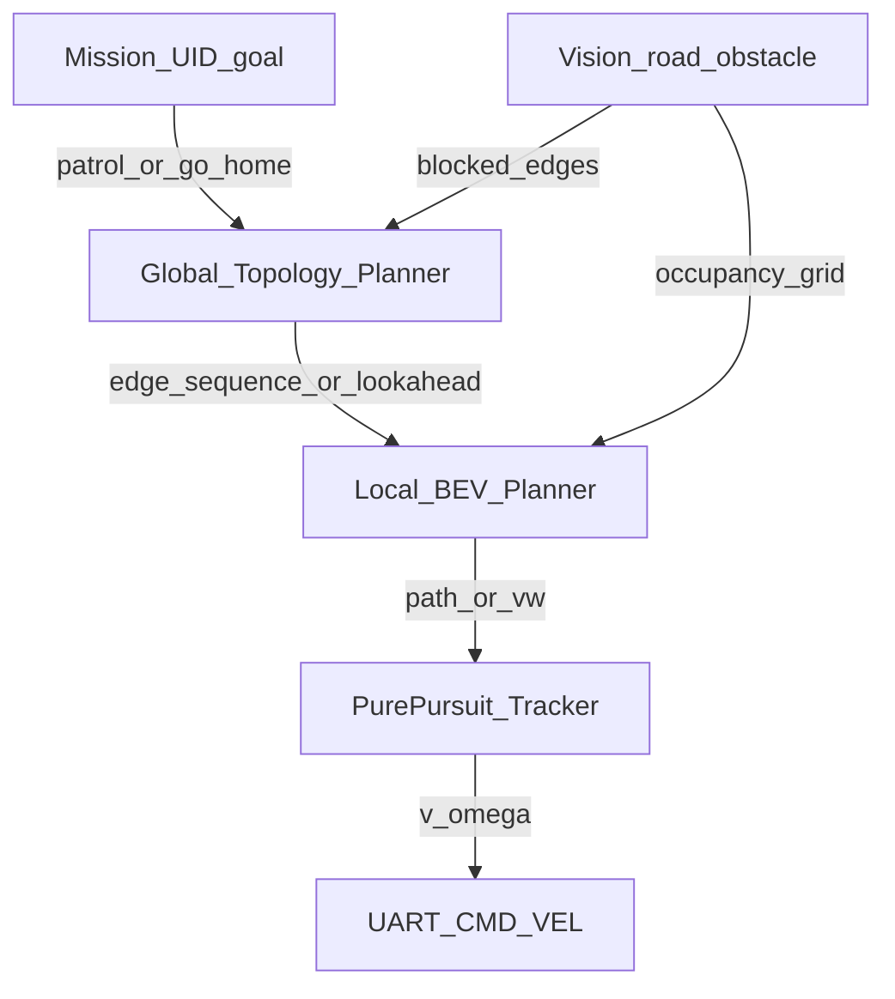
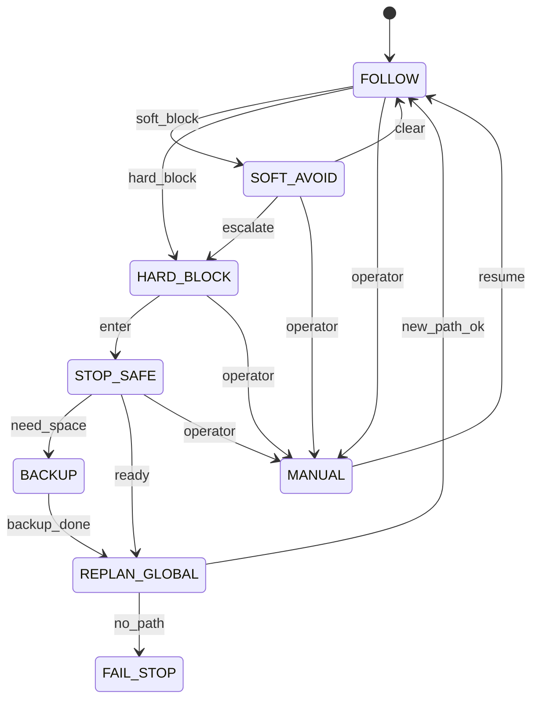

# 导航与障碍重规划（分层设计）

杭州侦察机器人上位机侧 **路径规划 / 遇障重规划** 设计规格。采用业界常见且贴合本赛题尺度的方案：**先验拓扑全局规划 + BEV 局部规划 + 寻线执行**。本文是设计稿，不含业务代码实现。

## Contents

- [定位与目标](#定位与目标)
- [与现有文档的关系](#与现有文档的关系)
- [分层架构](#分层架构)
- [先验拓扑（全局层）](#先验拓扑全局层)
- [行列命名与配置文件](#行列命名与配置文件)
- [BEV 占用与局部规划](#bev-占用与局部规划)
- [遇障状态机](#遇障状态机)
- [沿边进度与倒车](#沿边进度与倒车)
- [感知判堵](#感知判堵)
- [对外接口草案](#对外接口草案)
- [为何采用本方案](#为何采用本方案)
- [非目标](#非目标)
- [分阶段落地](#分阶段落地)
- [待确认项](#待确认项)
- [参考](#参考)

## 定位与目标

赛题要求：巡逻路线上最多出现 **3 个任意放置的障碍物**，机器人须 **自行重新规划行进路线** 以完成任务；鼓励纯视觉，不依赖超声/激光/主动红外可获加分；导航为未建稠密全局地图条件下的自主行进。

场地约 **3200×4400 mm**，侦察车道宽约 **800 mm**，两侧有约 **50 mm** 挡板。这是窄路网场景，不是旷野越野。

**本文目标**

1. 固定推荐架构：拓扑全局换道 + BEV 局部避障 + Pure Pursuit 执行。
2. 定义遇障时的安全动作（减速、停车、短距倒车）与全局重搜触发条件。
3. 给出与 Mission（UID 巡场）、Stage-1 寻线、UART `CMD_VEL` 的边界与接口草案。
4. 给出可分期落地的实现顺序。

**一句话：** 寻线负责「贴当前轨迹开」；局部层负责「眼前这一米」；拓扑层负责「这条走廊堵了换哪条」；Mission 负责「点齐了没、该不该回家」。

## 与现有文档的关系

| 文档 | 关系 |
| --- | --- |
| [`docs/superpowers/specs/2026-08-29-visual-nav-road-follow-design.md`](superpowers/specs/2026-08-29-visual-nav-road-follow-design.md) | Stage-1：mask → IPM → 中心线 → Pure Pursuit；交叉口默认自然延伸。本文在其上增加 **选岔/换边与障碍重规划**。 |
| [`docs/superpowers/specs/2026-08-29-ipm-centerline-proto-design.md`](superpowers/specs/2026-08-29-ipm-centerline-proto-design.md) | BEV 窗口与外参约定；局部占用栅格复用同一鸟瞰窗。 |
| [`docs/superpowers/specs/2026-09-02-mission-topology-and-gui-design.md`](superpowers/specs/2026-09-02-mission-topology-and-gui-design.md) | Mission / UID：收齐巡逻点、播报。Mission **不**实现换道细节；只提供「巡场中 / 回出发区」等目标语义。 |
| [`docs/architecture/overview.md`](architecture/overview.md) | 逻辑模块 `navigation` / `state` / `uart` 的总图位置。 |
| [`vision/ipm_proto/`](../vision/ipm_proto/) | 已有 IPM/中心线 Python 原型，局部层可在此演进。 |
| [`navigation/topo_proto/`](../navigation/topo_proto/) | 全局拓扑 Dijkstra + 模拟封边原型；见 `docs/reference/navigation/topo_proto.md`。 |

路径层与任务层解耦：即使 UID 采用「任意顺序、新卡即报」，遇障仍按本文重规划；不依赖写死的 1→2→… 行驶点序。

## 分层架构



| 层 | 职责 | 推荐算法 |
| --- | --- | --- |
| Mission | 12 UID 是否收齐、是否回出发区 | 集合 / 状态机（见 mission 规格） |
| 全局 Planner | 边序列；走廊堵死后换路 | 拓扑图上 **Dijkstra**（首选）或 **A\*** |
| 局部 Planner | 车前局部可通行轨迹 | BEV 栅格 **A\***（首选）；**DWA** 可选增强 |
| 执行 | 跟踪轨迹 | **Pure Pursuit**（或等价），输出 `(v, ω)` |
| 感知 | 可走区域与障碍 | road（及可选 obstacle）分割 → IPM |

手动遥控与急停由 `state` 仲裁，优先级高于自主规划（与 Stage-1 / mission 规格一致）。

## 先验拓扑（全局层）

### 地图性质

使用 **赛前先验拓扑图**，不是比赛中的 SLAM 稠密建图：

- **节点 / 边：** 见下一节行列命名；权威数据在 [`config/nav_topology.yaml`](../config/nav_topology.yaml)。
- 边属性可含长度、是否隧道、`blocked`（运行时）、双向标志。
- 节点坐标不必精确；搜路主要靠连通与 `length_m`。
- **`length_m` 必须 ≥ 0。** Dijkstra 不能用负权。倒车、惩罚都不写成负数：不想走的边用更大的正代价或 `blocked`；倒车是执行层 `BACKUP`（见下），不是 YAML 里的负边。
- 障碍最多 **3 个、巡逻路线上任意放置**，开赛前不知道在哪条边。YAML **不**预写障碍位置；现场视觉判堵后再 `set_edge_blocked`。

拓扑只回答「走廊怎么连、堵了换哪条」。贴路、短距倒车、UID 播报都不进这张图。

### 全局规划

- **正常：** 按 Mission 目标生成一条边序列（巡场覆盖或回 `S`）。第一版可用固定巡航环 + 回家路径；后续可按「未扫区域」优化。
- **重规划触发：** 当前边（或前方边）被标为硬堵塞 `blocked=true`，或局部层连续失败超过阈值。
- **算法：** 边数很少时用 **Dijkstra** 即可；需要启发时用 **A\***。不可走边代价为 ∞（或从邻接表移除）。
- **输出：** 有序边列表 + 当前边索引；或直接给出下一局部目标（下一节点在车体/地面系下的近似位姿，若有粗定位）。

### 与「绕一圈」的区别

禁止把策略写成「永远逆时针前进、从不改边」。绕向只能作为 **初始偏好**；一旦边 `blocked`，必须以拓扑重搜结果为准。窄路（约 800 mm）中间转不了弯：换走廊前先 **倒回上一拓扑节点**，再沿新边正向寻线。

## 行列命名与配置文件

对照赛题图 3，节点名采用 **`行_列`**。每一横档（如 ②↔⑪）中间是 **两个十字路口**，不是单点中间列。

| 规则 | 约定 |
| --- | --- |
| 行号 | 从上往下增大（离开出发区） |
| 列 `_1` | 左侧巡逻格（底边则为左起第 1 格） |
| 列 `_2` | 中间**偏左**十字（底边为第 2 格 / ≈⑥） |
| 列 `_3` | 中间**偏右**十字（底边为第 3 格 / ≈⑦） |
| 列 `_4` | 右侧巡逻格（底边右格 / ≈⑧） |
| 出发区 | `0_0`（接到第 1 行的 `1_2`、`1_3`） |
| 边 id | `"{u}__{v}"`（**必须加引号**；端点名字典序较小者在前） |
| 与播报点号 | **拓扑名 ≠「到达 X 号」**；UID→X 在 Mission 配置里 |

与图 3 位置的大致对应（仅便于读图，不写死播报号）：

```text
                    0_0 出发区
                   /    \
        1_1 -- 1_2 -- 1_3 -- 1_4     ≈① / 十字 / 十字 / ≈⑫
         |      |      |      |
        2_1 -- 2_2 -- 2_3 -- 2_4     ≈② / 十字 / 十字 / ≈⑪
         |      |      |      |
        3_1 -- 3_2 -- 3_3 -- 3_4     ≈③ / 十字 / 十字 / ≈⑩
         |      |      |      |
        4_1 -- 4_2 -- 4_3 -- 4_4     ≈④ / 十字 / 十字 / ≈⑨
         |      |      |      |
        5_1 -- 5_2 -- 5_3 -- 5_4     ≈⑤⑥⑦⑧
```

完整节点、边长、隧道初标见 **[`config/nav_topology.yaml`](../config/nav_topology.yaml)**（`meta.name: figure3_rowcol_v2`）。场测后只改 YAML，不必改命名规则。

## BEV 占用与局部规划

### 鸟瞰窗

与 IPM 原型默认对齐，实车标定后写入配置：

| 项 | 默认意向 |
| --- | --- |
| 前向 | 约 0.3–1.5 m |
| 横向 | 约 ±0.5 m（匹配约 800 mm 路宽） |
| 分辨率 | 约 0.01 m/px（可调） |

### 栅格语义

| 类别 | 来源 | 用途 |
| --- | --- | --- |
| free | road mask 投影且非障碍 | 可规划 |
| occupied | 障碍检测/分割投影，或非道路 | 不可撞 |
| unknown | 未观测 | 第一版视为谨慎可走或不可走（配置项，建议不可走更安全） |

对 occupied 做 **膨胀**（约半车宽 + 安全裕量），避免贴边擦障。

### 局部算法

**首选：局部 A\***

- 起点：车体在 BEV 中的位姿（可简化为车轴中心投影）。
- 终点：全局路径上的 lookahead 点（或当前边远端可行点）。
- 输出：BEV/地面系路径点列 → Pure Pursuit。

**可选增强：DWA**

- 在跟踪全局/局部参考的同时，采样 `(v, ω)` 做短时仿真，排斥碰撞。
- 不单独作为唯一规划器（易陷局部死胡同）；挂在 A\* 或中心线跟踪之外作贴身修正。

无多分支时，局部层可退化为 Stage-1 中心线提取；有障碍占用时必须以栅格规划或显式偏置中心线。

## 遇障状态机



| 状态 | 行为 |
| --- | --- |
| `FOLLOW` | 全局边序列 + 局部轨迹 + Pure Pursuit 前进 |
| `SOFT_AVOID` | 仍走当前走廊；局部 A\*/DWA 减速偏航绕行 |
| `HARD_BLOCK` | 判定当前走廊不可通过 |
| `STOP_SAFE` | `v→0`，ω 置安全值；保持 UART 心跳/零速策略 |
| `BACKUP` | 沿当前边以 `v<0` 退回 `from_node`（见下一节）；禁止倒完整条场、禁止负权边 |
| `REPLAN_GLOBAL` | `set_edge_blocked` → Dijkstra（起点 `from_node`）→ 更新边序列 |
| `FAIL_STOP` | 无可行路；停车告警，等待手动 |
| `MANUAL` | 操作者覆盖；规划冻结或仅更新地图不发自主速度 |

**软堵塞 vs 硬堵塞（建议阈值，场测标定）**

- 软：前方有占用，但横向仍存在宽度 ≥ 车宽 + 裕量的通道。
- 硬：前方 road 断开或可通行宽度持续低于阈值，或局部规划连续 N 次失败。

推荐顺序：硬堵塞 → `STOP_SAFE` → 封当前边 → Dijkstra（`from_node`）→ `BACKUP` 退到上一节点 → `FOLLOW` 新边正向开。若已在路口且障碍贴脸，可先短退再换边。

## 沿边进度与倒车

倒车写在 `navigation` 的 `tick()` / `BACKUP` 里，经 UART `CMD_VEL` 下发负线速度。**不要**写进 [`config/nav_topology.yaml`](../config/nav_topology.yaml)。Mission 不管倒车；uart 不知道「在倒车」，只发 `(v, ω)`。

前视导航相机倒车时仍对着障碍，**看不见身后路口**，因此不能靠纯视觉倒到十字，也不能用 `IMU_DEBUG` 加速度积分当尺子。

### 沿边进度 `s`

`s` 是软件里的标量：**离开上一拓扑节点 `from_node` 之后，沿当前边走了多少米**。不是场地坐标，不能拿 `ODOM_STATE.x/y` 去对 YAML 的节点 `(x,y)`。

权威测距用下位机 **`ODOM_STATE`（编码器平移 + 陀螺 Z 融合）**，且须 `VALID`（见 [`docs/api/uart.md`](api/uart.md)）。`IMU_STATE` 只辅助看姿态；`IMU_DEBUG` **禁止**进导航。

每帧沿航向积分（前进 `s` 增大，倒车自动减小）：

```text
ds = (x - x_prev) * cos(yaw) + (y - y_prev) * sin(yaw)
s  = max(0, s + ds)
```

**每到一个拓扑节点就把 `s` 置 0**（含中间十字 `*_2`/`*_3`，不只是 12 个 UID 巡逻格），然后换 `current_edge` / `from_node`，记下新的 `x_prev,y_prev`。不置 0 则 `s` 变成从出发区起的总路程，倒车会按错距离退。不必每到点发 `RESET_ODOM`；清零的是软件里的 `s`。

到点判定（前进时）：`s` 接近当前边 `length_m`（格子约 0.8 m，例如差 0.15 m 内），**或** BEV 出现分岔/横路。UID 只在部分巡逻格有，不能当所有十字的清零信号。

障碍是随机的：到点时 **不能**预知「这点到下一障碍几米」。开走后每帧更新 `s`，硬堵塞那一帧的 `s` 才是「这点到障碍」的近似值。

### 倒多少、倒到哪

目标是 **退回 `from_node`**，不是固定只倒 0.40 m。

- 停条件：`s < 0.15 m`（视为已回到上一节点），或本段倒车位移 ≥ **0.70 m**（硬帽，小于一格 0.8 m），或超时。建议 `v ≈ -0.08～-0.15 m/s`，`ω ≈ 0`。
- 已在路口（`s` 很小）但障碍仍贴脸：额外短退约 **0.40 m**（仍受 0.70 m 帽限制），只为腾空间、把障碍重新送进 BEV。
- 一次没退够：再短退约 0.3 m，最多两三次，避免按漂掉的 `s` 一次倒穿。
- 到路口后按新边序列 **正向寻线**。不要在格子中间掉头。

0.40 m 只解决贴脸腾空间；换走廊靠退回上一节点。YAML 坐标不是倒车瞄准点。

## 感知判堵

纯视觉优先，可叠加多种证据：

1. BEV 前方扇形 / 矩形 ROI 内 occupied 比例或最大可通行宽度。
2. 车前纵向若干米内 road mask 连通域断开。
3. 可选：专用 `obstacle` 分割/检测类（多类 YOLO-seg），与 road 一并投影。

输出两类信号：

- 给局部层：逐帧占用栅格。
- 给全局层：边级事件 `edge_id + blocked=true`（带滞回，避免闪烁反复重规划）。

相机安装（导航前视）与 Stage-1 / IPM 一致：车头居中、高度约 0.25 m、相对水平低头约 28°–30°，固定牢靠。

## 对外接口草案

语言无关；实现可为 Python 原型或 C++ `navigation` 模块。

```text
# 地图与全局
load_topology(graph) -> void
set_edge_blocked(edge_id, blocked: bool) -> void
set_mission_goal(kind: PATROL | GO_HOME | IDLE) -> void
replan_global(start_node) -> EdgePath | Failure

# 局部
update_occupancy(bev_grid) -> void
plan_local(lookahead_pose) -> LocalPath | Failure

# 执行与运行
tick(now) -> CmdVel     # 内部跑状态机；输出 v, omega
estop() -> void
set_manual(active: bool) -> void

# 调试快照（可供 GUI）
get_nav_snapshot() -> {
  mode, current_edge, from_node, s,
  blocked_edges, global_path, local_path_ok,
  last_block_reason, backup_active
}
```

`CmdVel` 单位与 UART 协议一致（m/s、rad/s）。`tick` 与 50 Hz 下发解耦：导航按自身周期更新最新指令，uart 线程只采最新值。

## 为何采用本方案

| 备选 | 不作为主方案的原因 |
| --- | --- |
| 固定绕场一圈 | 无法满足「遇障重规划」；堵死即失败 |
| 仅拓扑换边 | 障碍在边中段时过粗；须配合倒回 `from_node` |
| 负权边 / Bellman-Ford | 走廊长度为正；倒车不是负 `length_m` |
| 纯惯导加计积分定位 | 协议禁止 `IMU_DEBUG` 进导航；短距用 `ODOM_STATE` |
| 仅 BEV A\* / 仅 DWA | 缺全局换走廊能力，易局部迷路 |
| TEB / 重轨迹优化 | 调参与实现成本高，窄场性价比一般 |
| 端到端 RL / 大模型导航 | 数据与不可解释风险高；非本赛题首选 |

分层拓扑 + BEV 与清扫机器人、视觉导航工程中的 **topology–grid hierarchical planning** 同构，属当前可落地主流，而非过时方案。本赛题裁剪为：先验拓扑（非在线建图）+ 视觉 BEV（非激光）。

**第一期可先只做拓扑换边 + 停/短退**（用模拟 `blocked` 验证逻辑），再接视觉与 BEV 局部；最终形态仍以本文分层为准。

## 非目标

- 比赛中在线 SLAM / 稠密全局占据图作为唯一地图。
- 以 TEB、全场 Hybrid A\*、端到端策略作为 **主** 重规划器。
- 涵洞侦察、嫌疑人识别、UID 播报文案（见 vision / mission / audio）。
- 下位机电机控制细节（见 uart / 下位机仓库）。
- 用负 `length_m` 表达倒车或惩罚；用加速度积分当倒车尺子。

## 分阶段落地

1. **Stage-1 寻线稳定** — 直道/缓弯可贴路；`(v, ω)` 链路通。
2. **拓扑图 + 模拟 blocked** — 已有原型：`navigation/topo_proto/`（见 `docs/reference/navigation/topo_proto.md`）。
3. **视觉硬堵塞检测** — 接 `set_edge_blocked`；含停稳。
4. **倒回上一节点** — 沿航向积 `s`；`BACKUP` 倒到 `s≈0`（帽 0.70 m）；贴脸再短退 0.40 m。
5. **BEV 占用 + 局部 A\*** — 软避障与边中段处理。
6. **（可选）DWA、obstacle 类别、Hybrid A\* 倒车段** — 场测不够再加。

### Stage-1 并行清单（与拓扑搜路解耦）

| 项 | 现状 / 动作 |
| --- | --- |
| 导航相机姿态 | 车头居中、高约 0.25 m、相对水平低头约 28°–30°；与训数据姿态一致 |
| road 实采 | GUI 拍照 → `data/road/`；尽量无人入画、车载视角 |
| 分割训练 | 主机 YOLO-seg 单类 `road` → ONNX → RKNN（见 Stage-1 规格） |
| IPM / 中心线 | 仓库已有 `vision/ipm_proto/`；根目录 `PYTHONPATH=vision python3 -m ipm_proto.tests.test_pipeline` |
| `(v, ω)` / UART | 寻线稳定后再接 50 Hz 下发 |

与 Mission/UID **并行**：无读卡硬件时也可先做拓扑搜路与 road 数据。

## 待确认项

| 项 | 影响 | 向谁确认 |
| --- | --- | --- |
| 障碍物外形、尺寸、颜色、是否移动 | 检测类别与膨胀半径 | 领队会 / QQ 群 |
| 倒车硬帽 0.70 m、贴脸短退 0.40 m、是否允许上台倒车 | `BACKUP` 安全包络 | 队内场测 |
| 是否增加 YOLO `obstacle` 类或仅用「非 road」 | 感知管线 | 队内 |
| 隧道内无光时的判堵与速度策略 | 边属性 `tunnel` 专用逻辑 | 队内 + 规则 |
| 粗定位：仅里程计 / 路网匹配到哪一精度 | 全局起点节点如何估计 | 队内 |
| 与「纯视觉 +150」的传感器清单最终口径 | 读卡器已允许；勿引入超声/激光 | 规则答疑 |

## 参考

- 赛题：`杭州侦察机器人.pdf` — 障碍重规划、场地尺寸、纯视觉导向、图 3 路网。
- 拓扑数据：[`config/nav_topology.yaml`](../config/nav_topology.yaml)。
- Stage-1 寻线与 IPM/中心线规格（见上表链接）。
- Mission / UID 与 GUI 字段：`docs/superpowers/specs/2026-09-02-mission-topology-and-gui-design.md`。
- 工程背景：拓扑–栅格分层导航（全局连通搜索 + 局部占用规划）为移动机器人常见架构；本文件为其在本赛题上的裁剪定义。
- 里程计归属：[`docs/api/uart.md`](api/uart.md) — 倒车距离只用 `ODOM_STATE`。
