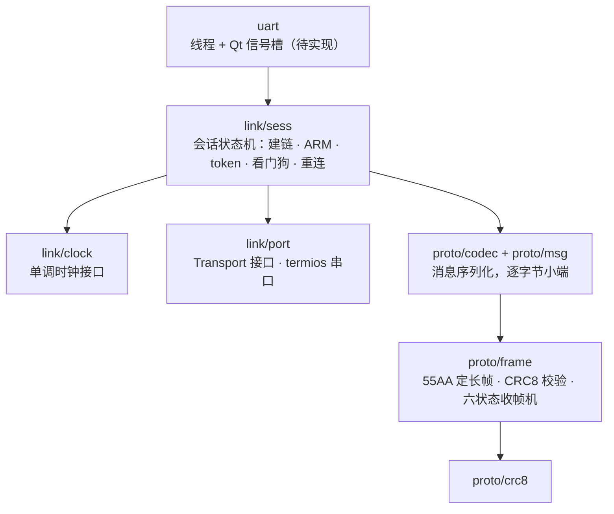

# Uart

## Contents

- [Overview](#overview)
- [Architecture](#architecture)
- [API](#api)
- [Design](#design)
- [Testing](#testing)

## Overview

`uart/` 负责上位机与 STM32H743 下位机之间的全部串口通信：帧的编解码、会话与 ARM 状态机、50 Hz 速度下发、遥测解析与诊断统计。

模块边界很硬：本模块只做协议与链路，不做任何业务决策。速度指令从哪来（自主导航还是手动遥控）由 `state` 仲裁，这里拿到的是已经定好的目标速度；遥测解析出来的里程计和姿态原样抛给上层，不做滤波、不做坐标变换、不做规划。

依赖只有标准库和 POSIX termios。Qt 仅用于对外的信号槽接口，协议核心不链接 Qt，保证能在无 Qt 环境下单测。

线协议见下位机仓库的 `UART_PROTOCOL.md`（唯一权威），上位机侧的实现约定见 `docs/api/uart.md`。

## Architecture

目录按职责分两层，边界在文件树上直接可见：

```text
uart/
├── uart.h / .cpp        对外唯一入口，唯一依赖 Qt 的一层（待实现）
├── proto/               纯协议：无 IO、无状态、无时间、无 Qt
│   ├── crc8.h/.cpp
│   ├── frame.h/.cpp
│   ├── msg.h
│   ├── codec.h/.cpp
│   └── detail/bytes.h   私有实现细节，禁止跨模块 include
├── link/                有状态、碰操作系统的部分
│   ├── port.h/.cpp
│   ├── clock.h/.cpp
│   └── sess.h/.cpp
└── tests/               镜像上面的结构，另有 mock/ 放假传输与假下位机
```

`proto/` 只依赖标准库，可以整个搬到别的项目、也能编进单片机。`link/` 依赖 POSIX 与系统时钟。构建上对应两个目标 `uart_proto` 与 `uart_link`，后者依赖前者；反向依赖会直接链接失败，所以分层不只是约定，是构建系统兜住的。proto 层的测试只链 `uart_proto`，纯协议代码里一旦悄悄用了串口或时钟就会编不过。

include 路径统一取模块根，源码里写成 `#include "proto/frame.h"`、`#include "link/sess.h"`，从引用处就能看出跨了哪一层。

依赖方向：



线程模型：一条通信线程同时承担接收解帧与 50 Hz 周期发送。接收侧从 `Transport` 读到字节就喂给分帧状态机，解出完整帧后解码并通过信号抛给上层，不在通信线程里做业务处理。发送侧按 `steady_clock` 维护 50 Hz 节拍，每拍取最新的目标速度发一帧 `CMD_VEL`。

上层写入目标速度、读取最新遥测都走加锁的最新值邮箱，不排队——速度指令是覆盖式的，历史值没有意义。

## API

公开接口的完整说明以各头文件的 Doxygen 注释为准，这里只列已实现的入口。

`proto/crc8.h` — `Crc8()` 一次性计算；`Crc8Update()` 单字节推进，供收帧状态机边收边算，省掉为校验再缓存整帧。

`proto/frame.h` — 协议常量（`kSync1`/`kSync2`、`kProtocolVersion`、`kFrameOverhead`、`kMaxPayloadSize`、`kMaxFrameSize`、`kInterByteTimeoutUs`）、`EncodeFrame()` 装配整帧、`Reassembler` 六状态逐字节收帧并维护 `Stats` 统计（帧数、CRC 错误、字节间超时、长度溢出）。`Feed()` 需要传入本批字节的到达时刻，用于字节间超时判断。

`proto/msg.h` — 消息 ID（`MsgType`）、结果码（`AckResult`）、远程状态（`RemoteState`）、能力位与状态位常量，以及 11 个有 payload 的消息的进程内结构体。只有数据定义，没有逻辑。

`proto/codec.h` — 各消息 payload 长度常量与字段级编解码。编码返回写入字节数，0 表示缓冲不足或字段非法；解码返回 bool，要求长度严格相等。MCU→主机方向也提供编码函数，供测试与仿真里的"假下位机"构造遥测帧。

`link/port.h` — `Transport` 抽象接口（`Read`/`Write`/`WaitReadable`，-1 表示链路损坏应重连），以及 termios 实现 `SerialPort`（raw 模式、8N1、无流控、打开时清空残留缓冲）。

`link/clock.h` — `Clock` 单调时间接口与 `SteadyClock` 实现。抽出接口是为了让超时与节拍能用假时钟测。

`link/sess.h` — `Session` 会话状态机，模块的主要对外面。`Start()` 进入建链，`Poll()` 由通信线程反复调用，`SetVelocity()` 写入覆盖式目标速度，`RequestArm()` / `RequestDisarm()` / `RequestResetOdom()` / `RequestClearFault()` 是管理命令，`Shutdown()` 做零速加 DISARM 收尾。状态查询有 `link_state()`、`remote_state()`、`arm_token()`、`config_valid()`、`peer_protocol_version()`、`request_pending()`，数据查询有 `telemetry()`、`time_sync()`、`diagnostics()`。时序参数集中在 `SessionConfig`。

`proto/detail/bytes.h` — 模块内部的小端序读写辅助，不对外暴露。

尚未实现：`uart.h/cpp` 的通信线程与 Qt 信号槽外壳。`Session` 本身已经是完整可用的，只是需要一个线程来驱动 `Poll()` 并把遥测转成信号。

单位一律沿用协议约定：距离 m、速度 m/s、角度 rad、角速度 rad/s。坐标系为 REP-103 的 `base_link`——X 向前、Y 向左、Z 向上，正角速度表示左转。

## Design

**分层动机**：CRC8 是纯函数，帧层只关心字节布局，消息层只关心字段语义，会话层才涉及状态与时间。这样黄金测试向量可以直接打在帧层，安全逻辑的错误可以在会话层用假时钟复现，不需要真串口。

**不 memcpy 结构体**：协议明确禁止把编译器结构体直接上线。所有字段逐字节读写，避免对齐、填充和 ABI 差异导致两端布局不一致。

**50 Hz 独立线程而非 Qt 定时器**：Linux 非实时，Qt 事件循环被 UI 或推理拖慢时定时器抖动可能超过下位机 250 ms 的命令看门狗，直接触发安全停车。用独立线程加单调时钟补偿周期更可控。

**指令有效期**：上层给的速度带本地有效期，超期后本模块主动改发零速而不是保持旧值。低频"最后速度保持"在这个协议下是错误用法。

**token 生命周期**：`boot_id` 变化（下位机复位）或链路重连都会让旧 token 失效，此时必须清空控制状态重新建链。本模块不缓存跨会话的 token。

**无序号带来的两条约束**（协议 v2 去掉了帧头里的序号）：

一是 `ACK` 只能按 `request_type` 配对，所以同一时刻只允许一个在途管理请求。`SendRequest()` 把管理命令串行化，在途期间的新请求直接拒绝并计入 `requests_refused_busy`，而不是发出去等一个无法归属的响应。等 `ack_timeout_ms`（默认 500 ms）超时后释放名额，但**不自动重发**——协议明确要求上位机不重发非幂等管理命令，重试与否留给上层决定。两个例外：`HELLO_REQ` 幂等且由 `HELLO_INFO` 回应，不占名额；`DISARM` 是停车动作，安全优先，任何时候都能发。

二是重复包与丢包检测在协议层不存在，`CMD_VEL` 靠"最后有效值覆盖"。这与本模块覆盖式邮箱的设计正好一致，但意味着链路层不再能识别乱序，安全完全依赖 token、K2 现场确认和 250 ms 看门狗。

**字节间超时**：帧收到一半断流超过 20 ms 就丢弃残帧。v2 没有 COBS 和结束符，帧边界完全由 `LENGTH` 决定，残帧一旦与后续字节拼接，有可能凑出长度和内容都错位、但 CRC 恰好自洽的"合法"帧。取值与固件的 `CAR_PROTOCOL_INTERBYTE_TIMEOUT_US` 对齐。

**CRC8 的强度权衡**：v1 的 CRC-32C 换成了 CRC-8，检错能力显著下降——8 位校验对随机错误有约 1/256 的漏检率，而 payload 最大 128 字节时单帧突发错误也可能漏过。这是下位机定的，上位机只能跟随；实际防线是 token 校验、`config_valid` 检查和看门狗，不能把安全性寄托在帧校验上。

**已知限制**：香橙派侧的 UART 针脚编号与设备节点尚未确定，硬件联调前只能跑 fake 传输层。下位机当前 `config_valid=0`，ARM 会返回 `ACK_DENIED_CONFIG`，运动控制要等对方绑定电机、编码器引脚和底盘参数后才能验证。

## Testing

方法为**带 mock 的单元测试**加**回放式的协议向量比对**，全部不需要硬件。测试不引入 GoogleTest，用 `tests/check.h` 里的极简断言，靠 CTest 判定进程返回值。

运行方式（在仓库根执行）：

```bash
cmake -B build -DCMAKE_BUILD_TYPE=Debug
cmake --build build -j
ctest --test-dir build --output-on-failure
```

判定标准是全部测试进程返回 0，任何断言失败都会打印文件行号与实际/期望的十六进制字节。

**已实现并通过**（`uart_crc8`、`uart_frame`、`uart_codec`、`uart_port`、`uart_sess` 五项全绿）：

CRC-8/ATM 用协议给定的 `CRC8("123456789") = 0xF4` 自检。这个检查值能同时锁住多项式、初值、反射方向和最终异或四个参数——任何一个搞错结果都不是 0xF4，而这类参数错误在只做往返测试时完全测不出来。另外验证逐字节推进与一次性计算等价、单比特翻转会改变结果。

帧层用文档里的黄金帧做字节级比对：`55 AA 01 01 02 70`（`HELLO_REQ`）与零速 `CMD_VEL` 的编码结果必须与文档完全一致，第三条故意保留旧 CRC 的坏帧必须计入 `crc_errors` 且不触发任何回调。v2 特有的几条：payload 里塞满 `55 AA` 必须按 `LENGTH` 正确定帧而不被误判为新帧；两帧粘连、以及整条字节流在**每一个**可能的位置切成两段，都要解出两帧；`LENGTH > 128` 计一次溢出并重新搜索同步字；坏帧最后一个字节恰好是 `0x55` 时后续帧仍能收到（与固件的重同步行为一致）；字节间超时后残帧被丢弃、超时窗口内的分片不受影响。另外覆盖逐字节喂入与整块喂入等价、0 到 128 全部长度的往返、以及三类非法编码参数的拒绝。

消息层的 payload 长度用 `static_assert` 锁死，改错编不过。字段偏移不能只靠编解码往返验证——偏移写错时往返仍然自洽，所以对照协议文档硬编码了关键字节位置：`CMD_VEL` 的 token 与两个 float 的 IEEE-754 位模式、`HELLO_INFO` 的 `capabilities`/`boot_id`/`config_valid`、`SYSTEM_STATUS` 偏移 32 的 `arm_token`、`ODOM_STATE` 偏移 48 与 `IMU_STATE` 偏移 40 的 `status_flags`。此外覆盖负编码器计数的往返、长度多一字节或少一字节均拒绝、NaN/Inf 在下发与接收两个方向都被拒绝、`command_age_ms` 的 `0xFFFFFFFF` 哨兵值不被当成数值、未知枚举值保守映射（未知状态不得变成 ARMED，未知结果码不得变成 OK）。

传输层的 termios 路径用**伪终端**测：真串口设备当前不存在，但 PTY 走同一套 termios 配置，raw 模式、二进制透传和 poll 行为都能覆盖，只有波特率和电平这类物理特性测不到。关键一条是让 `0x00`、`0x0A`、`0x0D` 和 XON/XOFF 的 `0x11`/`0x13` 原样往返——这些字节一旦被终端层改写或吞掉，表现就是随机丢帧，极难定位。此外覆盖无数据时 `WaitReadable` 超时、设备不存在与波特率不支持的失败路径、未打开时读写返回错误。内存 fake 另测了分片读取和读写失败注入。

会话层用假传输、假时钟和一个"假下位机"做一问一答式的交互测试，25 个用例，每条对应协议里一条明确要求：HELLO 重发直到收到 `HELLO_INFO`；`config_valid=0` 与未建链时都不得发出 `ARM_REQUEST`；`ARM_REQUEST` 必须携带本次 `boot_id`；未持有 token 时不发速度帧；拿到 token 后 100 ms 内恰好发 5 帧（50 Hz）且 token 与速度正确；指令超过本地有效期后改发零速而不是保持旧值、也不是停发；非有限速度在写入时就被拒；`boot_id` 变化清 token 并停止下发；下位机报告非 ARMED 时同步清 token；静默超过 1 s 掉线重连；传输报错关闭链路并清会话；`Shutdown()` 发 3 帧零速且 `DISARM` 排在最后；ARMED 下拒绝 `RESET_ODOM`；遥测与故障事件正确解析并带接收时刻；时间同步能估出 500 ms 的人为偏移，往返时延过大的样本被丢弃；`HELLO_INFO` 报的协议版本与本端不一致时不进入已连接、也不允许 ARM；文档第 9 节的坏 CRC 帧不影响会话状态且计入诊断；逐字节分片读取下行为不变。

v2 无序号相关的 5 条：`HELLO_REQ` 必须携带一字节协议版本且不占在途请求名额；在途管理请求期间第二个请求被拒且确实没有上线；类型对不上的 `ACK`（例如 `CMD_VEL` 出错回的 `ACK`）不能把在途请求误清掉；`ACK` 不来时超时释放名额但不自动重发；`DISARM` 不受在途请求阻塞。

**待实现**：`uart.h/cpp` 线程外壳的测试（线程启停与信号转发的冒烟测试）。

**测试逼出来的一个实现 bug**：`Session::Poll` 原先用"短读即读空"作为读取循环的结束条件。非阻塞 fd 上短读只表示"此刻可用这么多"，不代表后续没有数据，因此分片较小时会丢掉同一帧的后续字节。真串口上短读通常确实等于读空，所以这个错误在硬件联调里只会表现为偶发丢帧，极难定位；是 fake 的逐字节分片模式把它逼出来的。现在改为读到返回 0 才结束，并对单次 Poll 的字节数设上限，避免对端刷数据时饿死 50 Hz 发送节拍。

**与固件源码的对照结果**：字段偏移不只对照了协议文档，还逐条比对了下位机 `App/Src/ros_link.c` 里各消息的构造代码（`enqueue_ack`、`enqueue_hello`、`RosLink_BuildOdometry` / `BuildImu` / `BuildStatus` / `BuildFault`），全部一致。

对照固件补上了两处文档没写的细节。一是 `ACK` 的 payload 布局：文档第 7 节给了字段表，但 `enqueue_ack` 确认 `request_type` 在偏移 0、`result` 在偏移 1、`arm_token` 从偏移 2 起共 6 字节，与 v1 的 8 字节（含 uint16 序号）不同。二是字节间超时：文档第 4 节只说"接收超时后重新搜索同步字"，没给数值，`Config/car_config.h` 里的 `CAR_PROTOCOL_INTERBYTE_TIMEOUT_US` 是 20000（20 ms），本实现取同值。

还有一处行为一致性：`UartProtocolDecoder_Push` 在 CRC 校验失败时，若那个坏字节本身是 `0x55`，会直接进入"等第二个同步字"而不是从头搜索。这不影响正确性，但会影响紧跟其后的帧能否被立刻收到，本实现照抄了这个分支并单独测了它。

**Related**：[串口通信契约](../../api/uart.md) · [总体架构](../../architecture/overview.md)
