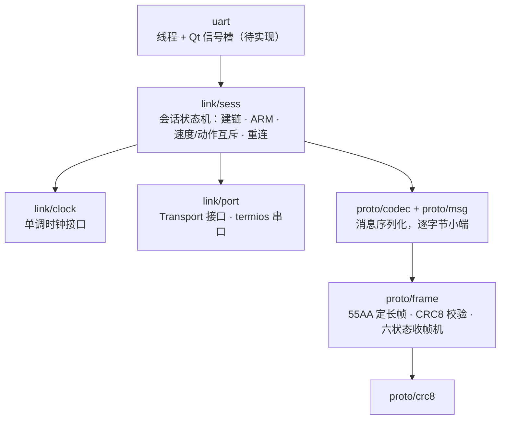

# Uart

## Contents

- [Overview](#overview)
- [Architecture](#architecture)
- [API](#api)
- [Design](#design)
- [Testing](#testing)

## Overview

`uart/` 负责上位机与 STM32H743 下位机之间的全部串口通信：帧的编解码、会话与 ARM 状态机、速度环 `CMD_VEL`、动作环 `MOTION_ACTION`、语音命令 `SPEAK_AUDIO`、遥测解析与诊断统计。

模块边界很硬：本模块只做协议与链路，不做任何业务决策。速度指令从哪来（自主导航还是手动遥控）由 `state` 仲裁，这里拿到的是已经定好的目标速度；遥测解析出来的里程计和姿态原样抛给上层，不做滤波、不做坐标变换、不做规划。

依赖只有标准库和 POSIX termios。Qt 仅用于对外的信号槽接口，协议核心不链接 Qt，保证能在无 Qt 环境下单测。

线协议见下位机仓库的 `UART_PROTOCOL.md`（唯一权威），上位机侧的实现约定见 `docs/api/uart.md`。

## Architecture

目录按职责分两层，边界在文件树上直接可见：

```text
uart/
├── uart.h / .cpp        对外唯一入口，唯一依赖 Qt 的一层（待实现）
├── proto/               纯协议：无 IO、无状态、无时间、无 Qt
│   ├── crc8.h/.cpp
│   ├── frame.h/.cpp
│   ├── msg.h
│   ├── codec.h/.cpp
│   └── detail/bytes.h   私有实现细节，禁止跨模块 include
├── link/                有状态、碰操作系统的部分
│   ├── port.h/.cpp
│   ├── clock.h/.cpp
│   └── sess.h/.cpp
└── tests/               镜像上面的结构，另有 mock/ 放假传输与假下位机
```

`proto/` 只依赖标准库，可以整个搬到别的项目、也能编进单片机。`link/` 依赖 POSIX 与系统时钟。构建上对应两个目标 `uart_proto` 与 `uart_link`，后者依赖前者；反向依赖会直接链接失败，所以分层不只是约定，是构建系统兜住的。proto 层的测试只链 `uart_proto`，纯协议代码里一旦悄悄用了串口或时钟就会编不过。

include 路径统一取模块根，源码里写成 `#include "proto/frame.h"`、`#include "link/sess.h"`，从引用处就能看出跨了哪一层。

依赖方向：


```mermaid
flowchart TB
  facade["uart<br/>线程 + Qt 信号槽（待实现）"]
  sess["link/sess<br/>会话状态机：建链 · ARM · 速度/动作互斥 · 重连"]
  clock["link/clock<br/>单调时钟接口"]
  port["link/port<br/>Transport 接口 · termios 串口"]
  codec["proto/codec + proto/msg<br/>消息序列化，逐字节小端"]
  frame["proto/frame<br/>55AA 定长帧 · CRC8 校验 · 六状态收帧机"]
  crc["proto/crc8"]
  facade --> sess
  sess --> codec
  sess --> port
  sess --> clock
  codec --> frame
  frame --> crc
```

线程模型：一条通信线程同时承担接收解帧与 50 Hz 周期发送。接收侧从 `Transport` 读到字节就喂给分帧状态机，解出完整帧后解码并通过信号抛给上层，不在通信线程里做业务处理。发送侧按 `steady_clock` 维护速度环节拍，仅在 `MotionMode::kVelocity` 时发 `CMD_VEL`。

上层写入目标速度、读取最新遥测都走加锁的最新值邮箱，不排队——速度指令是覆盖式的，历史值没有意义。

## API

公开接口的完整说明以各头文件的 Doxygen 注释为准，这里只列已实现的入口。

`proto/crc8.h` — `Crc8()` 一次性计算；`Crc8Update()` 单字节推进，供收帧状态机边收边算，省掉为校验再缓存整帧。

`proto/frame.h` — 协议常量（`kSync1`/`kSync2`、`kProtocolVersion`、`kFrameOverhead`、`kMaxPayloadSize`、`kMaxFrameSize`、`kInterByteTimeoutUs`）、`EncodeFrame()` 装配整帧、`Reassembler` 六状态逐字节收帧并维护 `Stats` 统计（帧数、CRC 错误、字节间超时、长度溢出）。`Feed()` 需要传入本批字节的到达时刻，用于字节间超时判断。

`proto/msg.h` — 消息 ID（`MsgType`）、结果码（`AckResult`）、远程状态（`RemoteState`）、能力位与状态位常量，以及各有 payload 的消息的进程内结构体。`0x95 RFID_CARD` 为 3 字节读卡结果，会话只保存最近一帧，不播报、不计分。只有数据定义，没有逻辑。

`proto/codec.h` — 各消息 payload 长度常量与字段级编解码。编码返回写入字节数，0 表示缓冲不足或字段非法；解码返回 bool，要求长度严格相等。MCU→主机方向也提供编码函数，供测试与仿真里的"假下位机"构造遥测帧。

`link/port.h` — `Transport` 抽象接口（`Read`/`Write`/`WaitReadable`，-1 表示链路损坏应重连），以及 termios 实现 `SerialPort`（raw 模式、8N1、无流控、打开时清空残留缓冲）。

`link/clock.h` — `Clock` 单调时间接口与 `SteadyClock` 实现。抽出接口是为了让超时与节拍能用假时钟测。

`link/sess.h` — `Session` 会话状态机。`Start()` 进入建链，`Poll()` 由通信线程反复调用，`SetVelocity()` 写入覆盖式目标速度（速度环），`RequestMotionAction()` 发离散动作（路口 90° / STOP），`RequestSpeech()` 请求下位机通过 UART4 播放 1～12 号预录音频，`RequestArm()` / `RequestDisarm()` 是使能命令，`Shutdown()` 做停车收尾。状态查询有 `link_state()`、`remote_state()`、`motion_mode()`、`command_enabled()`、`config_valid()`、`peer_protocol_version()`、`request_pending()`。

`proto/detail/bytes.h` — 模块内部的小端序读写辅助，不对外暴露。

尚未实现：`uart.h/cpp` 的通信线程与 Qt 信号槽外壳。`Session` 本身已经是完整可用的，只是需要一个线程来驱动 `Poll()` 并把遥测转成信号。

单位一律沿用协议约定：距离 m、速度 m/s、角度 rad、角速度 rad/s。坐标系为 REP-103 的 `base_link`——X 向前、Y 向左、Z 向上，正角速度表示左转。

## Design

**分层动机**：CRC8 是纯函数，帧层只关心字节布局，消息层只关心字段语义，会话层才涉及状态与时间。这样黄金测试向量可以直接打在帧层，安全逻辑的错误可以在会话层用假时钟复现，不需要真串口。

**不 memcpy 结构体**：协议明确禁止把编译器结构体直接上线。所有字段逐字节读写，避免对齐、填充和 ABI 差异导致两端布局不一致。

**独立线程而非 Qt 定时器**：速度环节拍用独立线程加单调时钟。下位机已无 250 ms 看门狗，但寻线仍需要稳定的 `(v, ω)` 刷新。

**指令有效期**：上层给的速度带本地有效期，超期后本模块主动改发零速。下位机不会因断流自动停车，所以上位机必须自己停。

**ARM 生命周期**：以 `ARM_REQUEST` 的 ACK 为准，没有 token。`boot_id` 变化或链路重连后必须重新 ARM。

**速度环与动作环互斥**：有限 `MOTION_ACTION` 未收到 `MOTION_RESULT` 时拒绝 `SetVelocity`；`STOP` 随时可发。长直道贴线走速度环；路口 90° 走动作环。本模块不融合视觉航向、不向下位机写 yaw；相对路面的朝向由 `navigation` 维护，见 [`docs/nav.md`](../../nav.md)。

**无序号带来的约束**：`ACK` 只能按 `request_type` 配对，同一时刻只允许一个在途管理请求，语音播放请求也占用这个名额。`HELLO_REQ` 不占名额；`DISARM` 与 `STOP` 不受名额限制。超时不自动重发。

**语音播放**：上层调用 `Session::RequestSpeech(audio_id)`，其中 `audio_id` 当前必须为 `1`～`12`。该调用只要求 USART2 已完成 HELLO，不要求电机 ARM。下位机 ACK 为 `ACK_OK` 时表示已接受并尝试通过 UART4 发送，不代表语音播放已经完成；当前 UART4 没有回传播放状态。

**字节间超时**：帧收到一半断流超过 20 ms 就丢弃残帧。取值与固件 `CAR_PROTOCOL_INTERBYTE_TIMEOUT_US` 对齐。

**已知限制**：香橙派 UART overlay / 设备节点尚未确定，硬件联调前只能跑 fake 传输层。尚未实现 `uart.h/cpp` 通信线程外壳，导航也还没接到 `Session`。

## Testing

方法为**带 mock 的单元测试**加**回放式的协议向量比对**，全部不需要硬件。测试不引入 GoogleTest，用 `tests/check.h` 里的极简断言，靠 CTest 判定进程返回值。

运行方式（在仓库根执行）：

```bash
cmake -B build -DCMAKE_BUILD_TYPE=Debug
cmake --build build -j
ctest --test-dir build --output-on-failure
```

判定标准是全部测试进程返回 0，任何断言失败都会打印文件行号与实际/期望的十六进制字节。

**已实现并通过**（`uart_crc8`、`uart_frame`、`uart_codec`、`uart_port`、`uart_sess` 五项全绿）：

CRC-8/ATM 用协议给定的 `CRC8("123456789") = 0xF4` 自检。这个检查值能同时锁住多项式、初值、反射方向和最终异或四个参数——任何一个搞错结果都不是 0xF4，而这类参数错误在只做往返测试时完全测不出来。另外验证逐字节推进与一次性计算等价、单比特翻转会改变结果。

帧层用固件黄金帧做字节级比对：`55 AA 01 01 01 79`（`HELLO_REQ`）与零速 `CMD_VEL` `55 AA 12 08 … 83` 必须完全一致，故意保留旧 CRC 的坏帧必须计入 `crc_errors` 且不触发回调。

消息层 payload 长度用 `static_assert` 锁死：`CMD_VEL` 8 字节、`SPEAK_AUDIO` 1 字节、`ACK` 2 字节、`HELLO_INFO` 7 字节、`ODOM_STATE` 21 字节、`MOTION_ACTION` 8 字节、`MOTION_RESULT` 11 字节、`RFID_CARD` 3 字节。未知状态不得变成 ARMED，未知 ACK 不得变成 OK。

会话层覆盖：HELLO 重试、ARM ACK 判定配置、未 ARM 不发速度、速度环 20 ms、指令过期改零速、boot_id 变化丢掉使能、FAULT 停命令、链路超时、`Shutdown`、版本不匹配、以及方案 C：有限动作挡住速度环直到 `0x94`、STOP 可随时打断、等待结果时拒绝第二个有限动作。

传输层的 termios 路径用**伪终端**测：真串口设备当前不存在，但 PTY 走同一套 termios 配置，raw 模式、二进制透传和 poll 行为都能覆盖，只有波特率和电平这类物理特性测不到。关键一条是让 `0x00`、`0x0A`、`0x0D` 和 XON/XOFF 的 `0x11`/`0x13` 原样往返——这些字节一旦被终端层改写或吞掉，表现就是随机丢帧，极难定位。此外覆盖无数据时 `WaitReadable` 超时、设备不存在与波特率不支持的失败路径、未打开时读写返回错误。内存 fake 另测了分片读取和读写失败注入。

会话层用假传输、假时钟和假下位机做交互测试：HELLO、ARM ACK、速度环、动作环互斥、掉线重连。

**待实现**：`uart.h/cpp` 线程外壳的测试（线程启停与信号转发的冒烟测试）。

**测试逼出来的一个实现 bug**：`Session::Poll` 原先用"短读即读空"作为读取循环的结束条件。非阻塞 fd 上短读只表示"此刻可用这么多"，不代表后续没有数据，因此分片较小时会丢掉同一帧的后续字节。真串口上短读通常确实等于读空，所以这个错误在硬件联调里只会表现为偶发丢帧，极难定位；是 fake 的逐字节分片模式把它逼出来的。现在改为读到返回 0 才结束，并对单次 Poll 的字节数设上限，避免对端刷数据时饿死 50 Hz 发送节拍。

**与固件源码的对照结果**：字段长度与 ID 对照下位机 `UART_PROTOCOL.md` / `uart_protocol.h`（协议标识 1，`CMD_VEL` 8 字节，`0x13` 为 `MOTION_ACTION`，`0x94` 为 `MOTION_RESULT`，`0x95` 为 `RFID_CARD`）。

字节间超时仍取固件 `CAR_PROTOCOL_INTERBYTE_TIMEOUT_US` = 20 ms。

还有一处行为一致性：`UartProtocolDecoder_Push` 在 CRC 校验失败时，若那个坏字节本身是 `0x55`，会直接进入"等第二个同步字"而不是从头搜索。这不影响正确性，但会影响紧跟其后的帧能否被立刻收到，本实现照抄了这个分支并单独测了它。

**Related**：[串口通信契约](../../api/uart.md) · [总体架构](../../architecture/overview.md) · [导航航向校准](../../nav.md)
