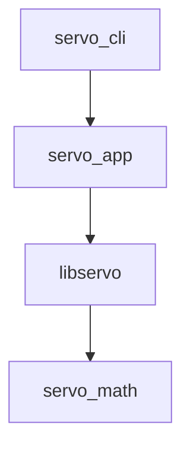

# servo — 180° 舵机硬件 PWM

## Contents

- [Overview](#overview)
- [Architecture](#architecture)
- [API](#api)
- [Design](#design)
- [Testing](#testing)

## Overview

`servo/` 是 C++ 模块：用香橙派 40 针 **物理 Pin 7（`PWM14_M2`）** 输出 50 Hz 舵机脉冲。不经过 STM32，不接入 UART / 导航 / GUI。

## 接线

舵机信号接到 40 针 **Pin 7**（`GPIO1_D6` / `PWM14_M2`），地接到任意 **GND**（必须与板子共地），电源用 **独立 5–6 V**，负极与 GND 相连。

不要从 3.3 V 给舵机供电。排针 5V 只适合空载试转，带载请用外部电源。

## Overlay

内核默认关掉 PWM。在 Orange Pi 官方镜像编辑 `/boot/orangepiEnv.txt`（ubuntu-rockchip 常见为 `/boot/firmware/ubuntuEnv.txt`），在 `overlays=` 中加入 `pwm14-m2`，重启。

```text
overlays=... pwm14-m2
```

重启后 `ls -l /sys/class/pwm`，把实际的 `pwmchipN` 路径写进 [`config/servo.yaml`](../../../config/servo.yaml) 的 `pwmchip`。运行用户需要对这些 sysfs 节点有写权限。RK3588 默认 PWM 极性是 `inversed`，驱动会改成 `normal`。

## 角度与脉宽

周期 20 ms（50 Hz）。默认线性映射，可在 YAML 里改端点：

0° -> `min_pulse_us`（默认 500 µs）；90° -> 两端点中点（默认 1500 µs）；180° -> `max_pulse_us`（默认 2500 µs）。

`AngleToPulseNs` 只接受 `[0, 180]`。CLI 在 `--hold-s`（默认 3 s）后把 `enable` 写成 0。

## Architecture

分层与 `uart` 一样，由 CMake 目标兜住依赖方向：

```text
servo/
├── math/          servo_math：角度→脉宽，无 IO
├── pwm/           sysfs PWM
├── servo.h/.cpp   门面 Servo::SetAngle / Close
├── app/           YAML + CLI（不链进 math 测试）
└── tests/         镜像上述目录；假 sysfs 自备 pwmX 节点
```



## API

`bool AngleToPulseNs(...)`：成功写入纳秒脉宽。

`SysfsPwm`：`Configure` / `Disable`。chip 路径可注入。内核负责创建 `pwmX`。

`Servo`：不拥有 `SysfsPwm*`。

`LoadConfig` 在 `app/`，读取 `pwmchip`、`channel`、脉宽端点。

## Design

测试不引入 GoogleTest 或 YAML 库。假 sysfs 由测试创建 `pwm0` 节点，生产代码不再 mkdir 伪造通道。

## Testing

```bash
cmake -B build
cmake --build build -j
ctest --test-dir build -R servo_ --output-on-failure
sudo ./build/servo/servo_cli --angle 90
```

## 相关文档

配置：`config/servo.yaml`。上手：`servo/README.md`。
