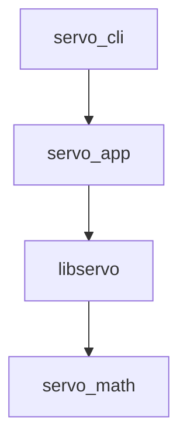

# servo — 180° 舵机硬件 PWM

## Contents

- [Overview](#overview)
- [Architecture](#architecture)
- [API](#api)
- [Design](#design)
- [Testing](#testing)

## Overview

`servo/` 是 C++ 模块：当前项目使用 **PWM14_M0** 输出 50 Hz 舵机脉冲，不经过 STM32。涵洞任务通过常驻 CLI 调用；单次 CLI 仍可独立使用。

## 接线

舵机信号使用用户已确认的 **PWM14_M0** 路由。旧的 Pin 7 / GPIO1_D6 / PWM14_M2 说明不适用于当前接线；排针物理位置须按当前板型原理图与实物核实，本文不猜测引脚。地必须与板子共地，舵机电源用独立 5–6 V，负极与 GND 相连。

不要从 3.3 V 给舵机供电。排针 5V 只适合空载试转，带载请用外部电源。

## Overlay

必须启用与 **PWM14_M0** 对应的设备树控制器和 pinctrl；可用 overlay 名称与修改方式依赖当前系统镜像，不能套用旧的 `pwm14-m2` 命令。修改系统配置、重启和实际试转需要另外授权。

只读检查 `/sys/class/pwm/pwmchip*/device/of_node/pinctrl-0`，与 live DT 的
`/sys/firmware/devicetree/base/pinctrl/pwm14/pwm14m0-pins/phandle` 对比。
一致后才把实际 `pwmchipN` 路径填入 [`config/servo.yaml`](../../../config/servo.yaml)，
`pwm_route` 为 `PWM14_M0`。编号可能随系统启用的 PWM 数量改变。

2026-10-08 对 192.168.92.163 的只读检查中，pwmchip0/pwmchip1 的 pinctrl 分别指向
PWM2_M1/PWM6_M0；未找到可用的 PWM14_M0 芯片。配置保留的 pwmchip2 不是已核实值。
识别入口会拒绝缺失芯片、错误路由或未确认的硬件配置，不会自动修改 overlay。

运行用户需要对 sysfs 节点有写权限。驱动配置极性为 `normal`。

## 角度与脉宽

周期 20 ms（50 Hz）。默认线性映射，可在 YAML 里改端点：

0° -> `min_pulse_us`（默认 500 µs）；90° -> 两端点中点（默认 1500 µs）；180° -> `max_pulse_us`（默认 2500 µs）。

`AngleToPulseNs` 只接受 `[0, 180]`。CLI 在 `--hold-s`（默认 3 s）后把 `enable` 写成 0。

`--stdin` 常驻模式保持输出，接收绝对角度命令并返回带请求 ID 的写入结果；
close、EOF 和 Linux INT/TERM/HUP 后关闭 PWM。没有位置传感器反馈，
`SERVO_APPLIED` 只证明 sysfs 写入成功。涵洞任务从 A→B 或 B→A 翻转一次，完成不归位。

## Architecture

分层与 `uart` 一样，由 CMake 目标兜住依赖方向：

```text
servo/
├── math/          servo_math：角度→脉宽，无 IO
├── pwm/           sysfs PWM
├── servo.h/.cpp   门面 Servo::SetAngle / Close
├── app/           YAML + CLI（不链进 math 测试）
└── tests/         镜像上述目录；假 sysfs 自备 pwmX 节点
```


```mermaid
flowchart TB
  cli[servo_cli]
  app[servo_app]
  facade[libservo]
  math[servo_math]
  cli --> app
  app --> facade
  facade --> math
```

## API

`bool AngleToPulseNs(...)`：成功写入纳秒脉宽。

`SysfsPwm`：`Configure` / `Disable`。chip 路径可注入。内核负责创建 `pwmX`。

`Servo`：不拥有 `SysfsPwm*`。

`LoadConfig` 在 `app/`，读取 `pwmchip`、`channel`、脉宽端点。

## Design

测试不引入 GoogleTest 或 YAML 库。假 sysfs 由测试创建 `pwm0` 节点，生产代码不再 mkdir 伪造通道。

## Testing

```bash
cmake -B build
cmake --build build -j
ctest --test-dir build -R servo_ --output-on-failure
sudo ./build/servo/servo_cli --angle 90
```

## 相关文档

配置：`config/servo.yaml`。上手：`servo/README.md`。
