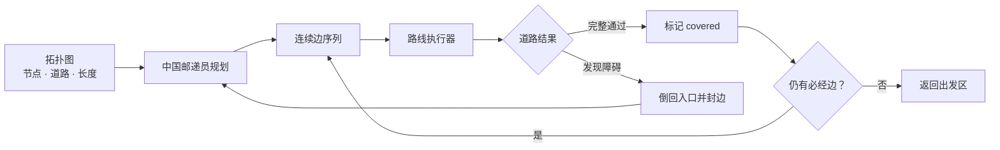
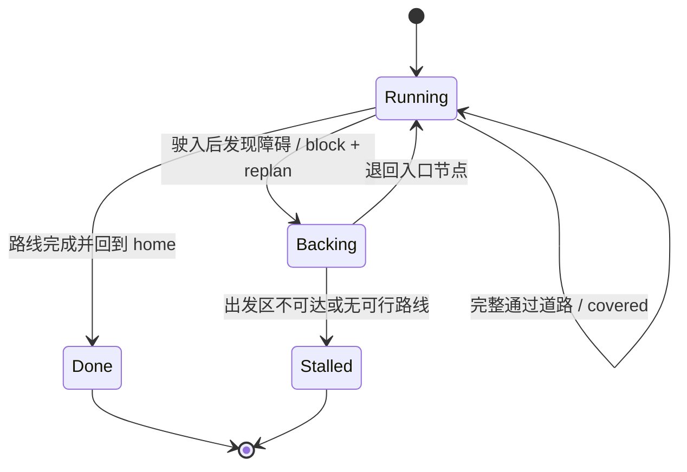

# 中国邮递员道路覆盖规划

## Contents

- [Overview](#overview)
- [Problem](#problem)
- [Theory](#theory)
- [Algorithm](#algorithm)
- [Implementation](#implementation)
- [Online replanning](#online-replanning)
- [Field example](#field-example)
- [Correctness and optimality](#correctness-and-optimality)
- [Complexity](#complexity)
- [Competition semantics](#competition-semantics)
- [Limitations](#limitations)
- [Testing](#testing)

## Overview

本项目需要从出发区出发，检查所有可通行道路，发现随机放置在道路上的涵洞和障碍，并最终返回出发区。只访问 12 个巡逻点不能保证经过连接这些点的每条道路，因此正式任务采用**边覆盖**而不是单纯的点访问。

静态、连通、无向路网的初始规划属于无向中国邮递员问题（Chinese Postman Problem，CPP）：寻找一条从指定节点出发、经过每条必经边至少一次、最后回到出发节点且总权重最小的闭合路线。

障碍位置事先未知时，问题会变成在线道路检查：先按当前已知路网求邮递员路线，驶入道路后发现障碍，再封闭该边并对尚未覆盖的道路重新规划。`demo/` 实现了这一算法原型和可视化状态机，不直接控制实车。



## Problem

将场地表示为带权图：

$$
G=(V,E,w)
$$

`V` 是出发区、路口和巡逻位置；`E` 是可通行道路；`w(e)` 是边的非负代价。当前实现使用 `length_m`，即道路长度。后续可将代价扩展为预计行驶时间。

给定：

- 当前节点 `current`；
- 最终节点 `home`；
- 尚未完成的必经边集合 `required_edges`；
- 当前已确认不可通行的 `blocked` 边。

规划器返回连续路线：

```python
CoveragePlan(
    nodes=(...),
    edges=(...),
    length_m=...,
    unreachable_edges=(...),
)
```

路线必须满足：

1. 从 `current` 开始；
2. 在不经过 `blocked` 边的前提下连续行驶；
3. 覆盖每条仍然可达的必经边；
4. 在 `home` 结束；
5. 静态初始全边覆盖时，使重复行驶代价最小。

当 `current == home` 时是闭合中国邮递员问题。当车辆遇障后从其他节点重新规划、但仍要求回到 `home` 时，是指定起终点的开放式道路检查问题。

## Theory

### Euler circuit

如果一个连通无向图中每个节点的度数都是偶数，图中存在欧拉回路：可以从某节点出发，每条边恰好经过一次并回到起点。

如果存在奇度节点，就不可能用闭合路线把每条边恰好走一次。任何闭合行程每次进入一个节点都必须再离开，因此行程在每个节点使用的边次数最终是偶数。

中国邮递员算法不删除必经道路，而是选择代价最小的一组道路进行重复，使所有奇度节点变成偶度，再求欧拉回路。

无向图的奇度节点数量一定为偶数，因此可以把它们两两配对。每对奇点之间补入一条最短路径，相当于重复这条路径上的道路。总代价最小的配对称为最小权完美匹配。

### Open route

如果起点 `current` 与终点 `home` 不同，最终欧拉路径应允许这两个节点为奇度，其余节点为偶度。

代码通过对奇点集合做对称差实现：

```python
odd.symmetric_difference_update((current, home))
```

直观上，这一步是在问：当前多重图的奇偶性距离“只让起点和终点为奇点”还差哪些节点。对结果集合做最小权匹配后，就能得到从 `current` 到 `home` 的欧拉路径。

## Algorithm

`demo/planner.py::plan_remaining()` 按以下步骤工作。

### 1. Validate input

检查 `current`、`home` 和 `required_edges` 是否存在于拓扑图中。当前 Demo 只接受双向道路，因为实现的是无向邮递员算法。

### 2. Find the reachable component

从 `current` 遍历未封闭道路，得到当前可达节点集合。`TopologyGraph.neighbors()` 会跳过 `graph.blocked` 中的边。

如果 `home` 不可达，规划器直接报告无法返回。端点不在当前可达分量内的必经边被记录到 `unreachable_edges`，不会被伪装成可执行路线。

### 3. Build required edge instances

每条可达且尚未完成的必经边先加入一次。算法使用“边实例”而不是只使用边 ID，因为同一条物理道路可能为了连接或修正奇偶性而重复多次。

```python
instances: list[tuple[str, str, str]]
```

每个实例保存 `(u, v, edge_id)`。多个实例可以拥有相同的 `edge_id`。

### 4. Connect separated required components

初始任务要求全部边时，必经边本身是连通的。但在线重规划会移除已完成边，剩余必经边可能分成多个互不相连的小块。

已经走过但仍可通行的道路允许作为连接道路再次经过。当前实现反复寻找任意两个必经分量之间最短的 Dijkstra 路径，将全局最短的一条连接路径加入 `instances`，直到所有必经边、`current` 和 `home` 位于同一个多重图分量。

这一步是贪心近似：保证生成连通且可执行的覆盖路线，但多个分量的连接组合不保证全局最小。

### 5. Find odd-degree vertices

统计当前边实例形成的多重图度数，收集所有奇度节点。如果 `current != home`，再与 `{current, home}` 做对称差。

### 6. Compute minimum-weight perfect matching

对奇点集合中的任意两点，用 Dijkstra 计算当前未封闭图中的最短路径。`route(a, b)` 使用缓存，避免动态规划反复计算相同节点对。

代码使用位掩码动态规划求精确的最小权完美匹配：

1. 从掩码中取第一个尚未配对的奇点 `i`；
2. 依次尝试把 `i` 与其他未配对奇点 `j` 配对；
3. 当前最短路代价加上剩余奇点的最优匹配代价；
4. 选择总代价最小的方案。

选中的每对奇点之间的最短路径被加入边实例，相当于决定哪些道路需要重复经过。

### 7. Generate an Euler walk

完成连接和奇点匹配后，多重图具备目标欧拉路径要求。实现使用 Hierholzer 算法生成连续行程：

1. 从 `current` 入栈；
2. 当前节点仍有未使用边实例时，沿其中一条边前进并继续入栈；
3. 没有未使用边时，将节点弹出并加入逆序结果；
4. 最后反转结果，得到节点和边序列。

算法最后验证：

- 所有边实例都已使用；
- 路线终点是 `home`。

## Implementation

核心代码分布如下。

`navigation/topo_proto/graph.py`：加载 `config/nav_topology.yaml`，维护 `blocked` 集合，提供 Dijkstra 最短路。

`demo/planner.py`：队友 Demo 中已经验证的规划器副本，保持 Demo 独立运行。

`agent/coverage/planner.py`：复制上述核心算法，作为后续实车 Agent 的正式扩展入口，实现剩余道路连接、奇点最小权匹配和 Hierholzer 欧拉行程，返回 `CoveragePlan`。

`demo/mission.py`：维护已覆盖道路、隐藏障碍、巡逻点进度和在线重规划状态。一次 `step()` 表示通过一段道路，或完成一次发现障碍/退回入口事件。

`demo/gui.py`：显示拓扑、规划中的下一条边、已覆盖道路、隐藏障碍、已确认封闭道路和车辆位置。

初始规划调用：

```python
plan = plan_remaining(
    graph,
    required_edges=set(graph.edges),
    current="0_0",
    home="0_0",
)
```

障碍后的规划调用：

```python
remaining = set(graph.edges) - covered - discovered
plan = plan_remaining(graph, remaining, current, home)
```

这里的 `discovered` 表示 Demo 已确认封闭的整条道路；它不会再作为必经边。

## Online replanning

障碍集合只属于仿真环境，不提前写入规划图。车辆只有准备进入相应道路时才发现障碍，避免规划器“偷看答案”。



发现障碍时，`PostmanMission` 执行：

1. 将道路加入 `discovered`；
2. 调用 `graph.set_edge_blocked(edge_id)`；
3. 保留车辆进入该边前的入口节点；
4. 用剩余必经边从入口节点重新规划到 `home`；
5. 模拟倒回入口节点；
6. 按新路线继续覆盖。

实车集成时，第 5 步不能只是离散状态跳转。Navigation 使用负速度 `CMD_VEL` 和视觉中心线持续纠偏，并用 `ODOM_STATE` 更新沿边进度；只有进度回到入口阈值并产生 `BACKUP_DONE`，才能推进拓扑位置并执行新路线。

## Field example

修正后的当前赛场拓扑包含：

- 20 个节点；
- 29 条道路；
- 12 个 `patrol_slot`；
- 起点先通过 `0_0__0_J` 的 0.15 m 直线到丁字口，再通过两条约 0.40 m 支路连接 ①/⑫；其余边大多为 0.80 m。

所有不同道路的长度之和约为 21.75 m。初始闭合邮递员路线包含 33 个边实例，总长度约为 24.30 m，因此额外重复约 2.55 m。

在当前确定性遍历顺序下，重复道路为：

- `5_2__5_3`；
- `3_4__4_4`；
- `3_1__4_1`；
- `0_0__0_J`（驶离和返回出发区各走一次）。

如果存在等长最优解，改变节点或边的稳定排序可能得到另一条总长度相同的路线；业务代码不应依赖某一条重复边永远固定。

使用测试障碍：

```text
1_2__2_2
2_1__2_2
3_1__3_2
```

Demo 能发现 3 条隐藏障碍，覆盖其余 26 条可通行道路，到达 12 个巡逻位置并返回 `0_0`。

## Correctness and optimality

在以下条件成立时，初始全边规划是标准无向中国邮递员解：

- 图连通；
- 所有道路双向；
- 边权非负；
- 所有边都要求至少覆盖一次；
- 起点和终点相同。

奇点之间使用真实最短路距离，位掩码动态规划求精确最小权完美匹配，因此增加的重复边总代价最小；随后 Hierholzer 使用每个边实例一次，得到最短闭合道路检查路线。

在线重规划时，剩余必经边可能不连通。当前实现先用贪心方式连接必经分量，再对形成的多重图做精确奇点匹配。因此它保证：

- 路线连续；
- 覆盖所有当前可达必经边；
- 避开已封闭道路；
- 回到指定 `home`。

但它不保证在线重规划后的整条路线是全局最短，因为分量连接顺序不是全局组合优化。

## Complexity

设当前图有 `|V|` 个节点、`|E|` 条边，奇点数量为 `k`，最终多重图边实例数为 `M`。

Dijkstra 使用二叉堆，单次约为：

$$
O((|V|+|E|)\log|V|)
$$

奇点配对需要查询多组节点间最短路，代码按需计算并缓存。位掩码最小权完美匹配的时间复杂度约为：

$$
O(k^2 2^k)
$$

空间复杂度约为 `O(2^k)`，外加最短路缓存。Hierholzer 为 `O(M)`。

当前赛场图规模很小，这些计算可在上位机上即时完成。若未来图规模显著扩大，应改用 Blossom 等通用最小权完美匹配算法，并避免枚举式分量连接。

## Competition semantics

本项目选择边覆盖，是因为涵洞随机放置在道路上。只访问所有巡逻点可能漏掉从未经过的道路及其涵洞。

正式任务建议分别维护：

```python
covered_edges: set[str]
visited_patrol_slots: set[str]
detected_tunnels: set[str]
completed_recon_tasks: set[str]
blocked_edges: set[str]
```

“道路已覆盖”不等于“该道路上的识别任务已成功”。例如车辆可能完整经过道路，但人脸或刀具服务不可用；任务层需要决定是否重试，不能通过修改邮递员的边覆盖状态掩盖识别失败。

正式完成条件应至少包含：

1. 所有可通行道路已经覆盖；
2. 所有可达巡逻任务已经完成或明确记录失败；
3. 已发现障碍均已记录；
4. 车辆已经返回出发区。

### Blocked edge semantics

本项目采用确定的整边封闭语义：车辆在 `current_edge` 上确认障碍后，立即停车并把整条物理边加入 `blocked_edges`。本轮任务不再从任意一端尝试该边，也不从障碍侧面绕行。

车辆仍位于边中间时，只能沿原行驶轨迹倒车回该边的入口节点 `from_node`。禁止继续向前试探，也禁止在障碍前原地掉头。倒车使用负速度 `CMD_VEL`，视觉负责走廊纠偏，里程计负责判断是否回到入口。只有 Navigation 产生 `BACKUP_DONE`，才能把拓扑位置恢复为 `from_node`，随后从该节点对尚未覆盖的可通行道路重新规划。视觉丢失、动作超时、距离达到安全帽但仍未到入口，或入口位置无法确认，都进入停车故障状态，不能假装已经退回节点。

## Limitations

当前边权只计算距离，没有计算转弯、停车、识别和低速通过涵洞的时间。同样长度的路线可能因为 90° 转弯次数不同而具有不同实际耗时。实车闭环稳定后，可扩展为带转向代价的道路检查问题。

当前实现只支持双向道路。单行边或同一物理道路两个方向具有不同代价时，需要有向中国邮递员算法。

规划器输出拓扑边序列，不直接输出直行、左转、右转或倒车。实车还需要路线执行器根据入边、出边和车辆朝向生成动作，并等待 RFID、视觉路口、里程计及 UART 动作结果推进状态。

障碍后的分量连接使用贪心近似。它适合当前小图的在线恢复，但不能作为任意动态图上的全局最优保证。

Demo 的一次 `step()` 会直接跨越一条道路，没有模拟车辆速度、制动距离、转弯半径、定位误差或相机检测延迟。

## Testing

运行规划与任务状态测试：

```bash
PYTHONPATH=. python3 -m unittest demo.tests.test_demo
```

列出当前拓扑道路：

```bash
python3 -m demo --list-edges
```

运行带三个隐藏障碍的无界面演示：

```bash
python3 -m demo --headless \
  --obstacles 1_2__2_2 2_1__2_2 3_1__3_2
```

启动图形演示：

```bash
python3 -m demo
```

测试应持续验证：闭合图只走必要边、奇点道路按最小代价重复、剩余必经块可借用已走道路连接、隐藏障碍不会提前泄漏给规划器、封边后路线连续、可达任务完成后返回出发区。

**Related:** [算法实车接入计划](postman-integration-plan.md) · [拓扑 Dijkstra 原型](topo_proto.md) · [上层路径规划](upper-planner.md) · [拓扑定位与 RFID](topology-rfid-navigation.md) · [道路覆盖 Demo](../../../demo/README.md)
