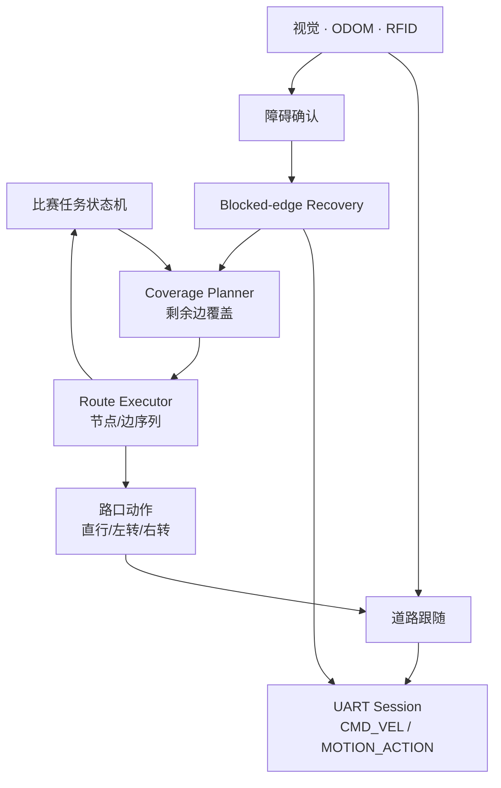
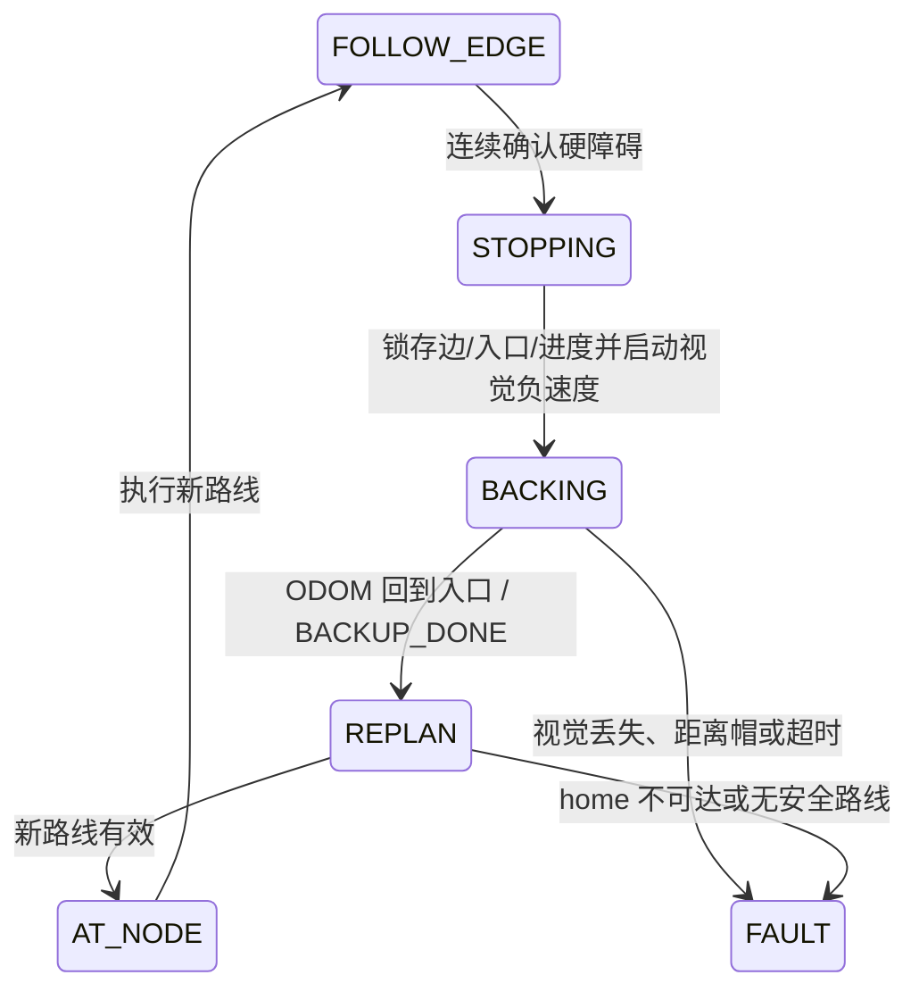

# 中国邮递员算法实车接入计划

## Contents

- [Goal](#goal)
- [Confirmed rules](#confirmed-rules)
- [Current foundation](#current-foundation)
- [Target architecture](#target-architecture)
- [Runtime state](#runtime-state)
- [Normal execution](#normal-execution)
- [Blocked-edge recovery](#blocked-edge-recovery)
- [Implementation phases](#implementation-phases)
- [Interfaces](#interfaces)
- [Tests and acceptance](#tests-and-acceptance)
- [Risks](#risks)

## Goal

把 `demo/planner.py` 中已经验证的中国邮递员道路覆盖算法接入实车导航，使车辆能够：

1. 从 `0_0` 出发，覆盖所有当前可通行道路；
2. 根据规划边序列在路口选择直行、左转或右转；
3. 在道路中间发现障碍后安全停车；
4. 将当前整条道路永久封闭；
5. 只沿原路倒车回入口节点；
6. 收到倒车完成结果后，从入口节点覆盖剩余道路并最终返回 `0_0`。

首版以正确、安全、可回放为目标，不要求障碍后的全局最短路线。

## Confirmed rules

- 任务目标是尽量覆盖全部道路，不只是访问 12 个巡逻点；涵洞随机放置，未经过的道路可能漏检。
- 道路均按双向边处理，权重暂用 `length_m`。
- 确认障碍即认为整条 `current_edge` 堵塞，本轮任务永久加入 `blocked_edges`。
- 不做软绕障，不从道路另一端再次试探同一条封闭边。
- 障碍前禁止继续前进，禁止原地掉头；唯一恢复动作是沿来路倒车到 `from_node`。
- 封边可以在发现障碍时立即写入状态，但重新规划得到的新路线只能在 Navigation 产生 `BACKUP_DONE` 后执行。
- 视觉丢失、倒车超时、里程无效、达到距离安全帽仍未回到入口，或入口节点不确定时立即停车并进入 `FAULT`。
- 下一轮比赛重新加载拓扑，不继承上一轮的 `blocked_edges`。

## Current foundation

| 能力 | 现有位置 | 状态 |
| --- | --- | --- |
| 拓扑 YAML、封边、Dijkstra | `navigation/topo_proto/graph.py` | 已有 |
| 中国邮递员覆盖与剩余边重规划 | `demo/planner.py`、`agent/coverage/planner.py` | Demo 保持不变；Agent 已复制并建立一致性测试 |
| Agent 边级状态机 | `agent/state.py`、`agent/route_agent.py` | 已有；覆盖正常推进、封边、倒车完成后重规划和故障停车 |
| Navigation 事件适配 | `navigation/agent_bridge.py` | 已有；复用沿边里程并转换节点、障碍和倒车终态事件 |
| 在线覆盖仿真 | `demo/mission.py` | 已有，不能直接控制实车 |
| 道路跟随和路口识别 | `navigation/road_follow/` | 单项已有 |
| 沿边进度 | `navigation/road_follow/backup.py::EdgeProgress` | 已有，待接统一状态机 |
| 障碍检测到整边硬堵塞事件 | `vision/obstacle/blockage.py` | 接口和单测已有，空间阈值待实车回放标定 |
| 视觉闭环倒车 | `navigation/road_follow/backup.py` | 负速度 `CMD_VEL`、视觉纠偏和 ODOM 到点已有，待实车标定 |
| 任务协调器骨架 | `mission/mission_coordinator.*` | 已有，但还没有边级规划接口 |

当前 `navigation.road_follow` 的命令行把遇障倒车与路口转向设置为互斥模式，适合单项测试，不是完整比赛入口。接入时应复用其中的控制器，不应通过同时开启多个互斥 CLI 参数拼装正式任务。

## Target architecture



建议首版继续使用 Python 实现 Agent，因为规划器、拓扑、道路跟随和倒车状态机都已经是 Python。不要在接入前先把邮递员算法重写成 C++；重写会同时引入算法一致性和跨语言接口两类风险。稳定跑通后，再决定是否把纯规划核心移植到 C++。

Agent 与 Navigation 保持并列。Agent 负责决定下一条道路，Navigation 负责实际完成这条道路：

```text
agent/
  coverage/
    planner.py     从 demo/planner.py 复制的覆盖算法
  state.py         本轮覆盖、封边和拓扑位置
  route_agent.py   边序列推进、遇障决策和重新规划
navigation/
  route_executor.py    路口动作与边执行
  blocked_recovery.py  停车、倒车和动作完成确认
```

`demo/` 保持原有代码和导入关系，不依赖 Agent。Agent 中的初始算法副本通过行为一致性测试与 Demo 对照；后续如果 Agent 因实车需求独立演进，应明确更新测试预期并记录差异，不能让两份实现无意间分叉。

## Runtime state

正式状态至少保存：

```python
home: str
current_node: str
from_node: str | None
to_node: str | None
current_edge: str | None
incoming_node: str | None
route_nodes: tuple[str, ...]
route_edges: tuple[str, ...]
route_index: int
covered_edges: set[str]
blocked_edges: set[str]
visited_patrol_slots: set[str]
visited_cards: set[int]
slot_to_card: dict[str, int]
card_to_slot: dict[int, str]
traversed_tunnels: set[str]
edge_progress_m: float
phase: str
```

关键不变量：

- `current_node` 只表示车辆已经确认到达的拓扑节点；车辆在边中间时不能提前改成 `to_node`。
- 只有完整到达 `to_node` 后，才能把 `current_edge` 加入 `covered_edges`。
- 障碍边只进入 `blocked_edges`，不能同时进入 `covered_edges`。
- 倒车期间拓扑位置仍以 `from_node` 为恢复目标；Navigation 根据 ODOM 产生 `BACKUP_DONE` 后才正式回到该节点。
- 规划器只能读取已确认状态，不能读取尚未发生的仿真障碍或猜测障碍位置。

## Normal execution

启动时加载拓扑，以全部边为 `required_edges`：

```python
plan_remaining(graph, set(graph.edges), current="0_0", home="0_0")
```

路线执行器每次只下发下一条边，不把整条路线一次性转换成不可撤销的动作队列：

1. 在节点处读取 `route_nodes[index:index+3]`；
2. 根据上一节点、当前节点和下一节点的拓扑坐标计算 `STRAIGHT/LEFT/RIGHT`；
3. 完成路口动作并重新找到道路后，将下一条边设为 `current_edge`；
4. 道路跟随期间持续更新 `edge_progress_m`；
5. 根据 `to_node.role` 选择到达判据：`patrol_slot` 由新的 RFID 事件确认，`junction` 由 ODOM 末端门限、稳定路口视觉和到中心的 `FORWARD_DONE` 共同确认；接近两类节点时，侧边角只锁存，正前方 BEV 检测带稳定无 road mask 后才允许唯一一次 200 mm 有限前进；
6. 将该边加入 `covered_edges`，推进 `route_index`，再处理下一条边。

任何动作失败都不能推进路线索引。手动停止、UART 掉线和急停也必须冻结拓扑状态。

RFID 卡号在比赛现场随机摆放，不能用于反推拓扑节点。首次到达 `patrol_slot` 时，由当前路线的 `to_node` 确定物理位置，再建立 `slot_to_card` / `card_to_slot` 映射；重访时检查映射一致，但只通过 `visited_cards` 控制是否重复播报。前三条中央隧道的端点是无标签 `junction`，第四条 `5_2__5_3` 的端点有标签，两类隧道必须分别使用对应的到达判据。

## Blocked-edge recovery



严格处理顺序：

1. 连续多帧确认障碍，立即输出零速；
2. 原子锁存 `current_edge`、`from_node` 和 `edge_progress_m`；
3. 将 `current_edge` 加入 `blocked_edges`，并调用 `graph.set_edge_blocked()`；
4. 取消当前路线，禁止任何前进、转向和道路跟随命令；
5. 每帧发送负速度 `CMD_VEL(v, omega)`，由视觉中心线持续修正 `omega`；
6. 用 `ODOM_STATE` 持续减小沿边进度，进度回到入口阈值后发送零速并产生 `BACKUP_DONE`；
7. 确认回到 `from_node`，清零沿边进度；
8. 计算 `remaining = all_edges - covered_edges - blocked_edges`；
9. 从 `from_node` 调用 `plan_remaining(graph, remaining, from_node, home)`；
10. 新路线有效后才恢复节点处动作和正向道路跟随。

可以在倒车期间后台计算候选路线以节省时间，但它只能以 `from_node` 为起点，并且不能在 `BACKUP_DONE` 前执行。

当前 `BackupConfig.max_distance_m` 为 0.70 m，而普通边约 0.80 m。正式接入前必须根据障碍最远触发位置和实车制动距离校准；达到 0.70 m 帽但沿边进度仍未回到入口时必须进入 `FAULT`，不能上报拓扑到点。

## Implementation phases

### Phase 1: Establish the Agent planner

- 新建顶层 `agent/` 和 `agent/coverage/`；
- 从 Demo 复制 `CoveragePlan` 和 `plan_remaining()`，不修改 Demo；
- 增加 Agent 独立测试和与 Demo 的行为一致性测试，锁定当前 24.5 m 初始路线结果；
- 验证封边后不会在返回路线中出现 blocked 边。

完成标准：Demo 行为不变，Agent 可以独立调用规划器，并且初始规划结果与 Demo 一致。

### Phase 2: Add the route executor

- 实现边级运行状态和路线索引；
- 实现入边/出边到 `LEFT/RIGHT/STRAIGHT` 的确定性转换；
- 对接巡逻点 RFID 到达和普通路口到达事件；
- 只有到达确认才能完成边和推进节点；
- 用假事件连续执行完整的 31 个初始边实例。

完成标准：无摄像头、无串口时，事件回放可以覆盖 28 条道路并回到 `0_0`。

### Phase 3: Integrate obstacle reverse

- 把 `backup.py` 从 CLI 单项模式接入统一路线执行器；
- 障碍触发时锁存当前边和入口节点；
- 删除正式流程中的软绕障、前进试探和原地掉头分支；
- 以 ODOM 沿边进度回到入口并产生 `BACKUP_DONE` 作为唯一的回节点成功条件；
- 倒车失败、超时和距离无效统一进入 `FAULT`。

完成标准：注入任意一条障碍边时，命令顺序必定是 `零速 → 视觉负速度 CMD_VEL → 零速/BACKUP_DONE → REPLAN`，中间不存在正向速度或转弯动作。

### Phase 4: Connect road following and UART

- 用统一进程驱动道路跟随、路口动作和倒车动作；
- 复用 `uart::Session` 的动作互斥与结果通知；
- UART 重连后重新 ARM，但不自动重放未确认的有限动作；
- 对 `CMD_VEL` 设置有效期，任务状态停止时持续保证零速；
- 将关键事件写入结构化日志。

完成标准：台架测试能够完成前进、停车、视觉闭环倒车和恢复寻线，动作结果与拓扑状态一一对应。

### Phase 5: Field validation

- 先在单条道路标定沿边进度和倒车距离；
- 再做一个路口的正向通过和遇障返回；
- 再做封一条边后的局部重规划；
- 最后跑完整全边覆盖和三个随机障碍；
- 每次均核对日志中的 `covered_edges`、`blocked_edges`、节点和 UART 结果。

完成标准：三个障碍均只触发一次，封闭边不再进入路线，所有仍可达道路被覆盖，车辆最终回到 `0_0`；如果回场不可达则安全停车并明确报告。

## Interfaces

规划接口保持纯函数风格：

```python
plan_remaining(
    graph: TopologyGraph,
    required_edges: set[str],
    current: str,
    home: str,
) -> CoveragePlan
```

路线执行器建议消费明确事件，而不是读取模块内部变量：

```python
EDGE_ENTERED(edge_id, from_node, to_node)
EDGE_PROGRESS(edge_id, distance_m)
NODE_REACHED(node_id)
OBSTACLE_CONFIRMED(edge_id)
BACKUP_DONE(edge_id, node_id)
BACKUP_FAIL(edge_id, reason)
TURN_DONE(direction)
TURN_FAIL(direction, reason)
```

每个事件应包含单调时间戳，并写入日志。这样既能做离线回放，也能定位“物理动作完成但拓扑状态未推进”或相反的问题。

现有 C++ `mission::NavigationTask` 只接受目标巡逻点和简单运动意图，无法表达边序列、封边和倒车完成。首版可让 Python 导航编排层拥有边级状态，再把巡逻点、播报和总体完成事件交给 Mission；不要让 C++ Coordinator 和 Python 同时各自维护一份 `current_node`。后续若统一到 C++，必须先定义单一状态所有者和等价事件接口。

## Tests and acceptance

必须增加以下自动测试：

- 初始规划覆盖全部 28 条边并回场；
- 重复道路只作为行程实例，不重复计覆盖得分；
- 障碍边立即进入 `blocked_edges`，不进入 `covered_edges`；
- `BACKUP_DONE` 前不能执行新路线；
- 视觉丢失、距离帽和超时进入 `FAULT`；
- 重规划路线不含任何 blocked 边；
- 已覆盖道路允许作为连接路再次经过；
- 封边导致部分道路不可达时准确报告 `unreachable_edges`；
- 出发区不可达时停车，不伪造任务完成；
- 三障碍回放最终覆盖 25 条可通行道路、到达 12 个巡逻位置并回场。

实车验收日志至少记录：

```text
timestamp phase current_node current_edge from_node to_node
edge_progress_m covered_edges blocked_edges route_index
motion_command motion_result obstacle_confidence failure_reason
```

## Risks

- 沿边里程低估会让倒车停在道路中间；高估会撞过入口路口。先标定再接全场。
- 障碍误检会永久损失一条边，因此需要连续帧、距离区域和可通行宽度联合确认。
- 前视相机倒车时看不到车尾，倒车终点必须主要依赖锁存里程和 UART 动作结果。
- 路口动作完成不等于已经稳定找到新道路；必须等重新寻线成功后才进入下一条边。
- 规划器是无向图模型；任何方向限制都必须先进入拓扑模型，不能只在执行层临时拒绝。
- 在线剩余分量连接目前是贪心近似，保证当前实现下的可行覆盖，但不承诺全局最短。

**Related:** [中国邮递员道路覆盖规划](chinese-postman.md) · [上层路径规划](upper-planner.md) · [道路跟随与障碍重规划](../../nav.md) · [UART 通信](../comm/uart.md)
