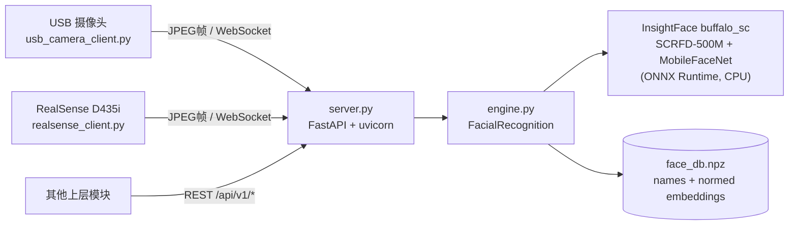

# arcface-lite

## Contents

- [Overview](#overview)
- [Architecture](#architecture)
- [API](#api)
- [Design](#design)
- [Testing](#testing)

## Overview

arcface-lite 是运行在香橙派（RK3588）上的轻量级人脸识别服务，从 Radish 项目的 `service/arcface` 提取并独立化，去掉了 ROS 依赖。它负责人脸检测、embedding 提取、人脸注册与识别，并通过 HTTP + WebSocket 对外提供服务。

模块边界：只处理 RGB 图像到"是谁"的映射。不负责相机驱动（客户端自行采图）、不做活体检测、不做跟踪；识别结果中的 `direction_px`（人脸相对画面中心的水平偏移，单位像素）供上层做云台/头部转向控制，但控制逻辑不属于本模块。

代码在 `arcface-lite/`，安装与上手步骤见 `arcface-lite/README.md`。

## Architecture

服务与客户端分离：识别推理集中在服务器一侧，客户端只负责采图和 JPEG 编码，因此摄像头可以接在任何一台能联网的机器上。



所有推理经过一把 `asyncio.Lock` 串行化（`asyncio.to_thread` 放到线程池执行），避免并发请求在 CPU 上互相挤占导致延迟抖动。人脸库是进程启动后按需读写的本地 `.npz` 文件，没有外部数据库依赖。

## API

HTTP/WebSocket 线协议契约（请求/响应格式、错误码）见 [../../api/face.md](../../api/face.md)。

Python 侧的核心入口是 `engine.py` 的 `FacialRecognition` 类：

`recognize_from_frame(color_img, db_path, threshold=0.45)` 输入 BGR uint8 帧（H, W, 3），返回 `(vis_img, results)`；`results` 中每项含 `name`、`score`（余弦相似度，越高越像）、`bbox`（x1, y1, x2, y2，像素）、`direction_px`。

`register_face_from_frame(color_img, person_name, db_path)` 取画面中最大的人脸注册入库，返回 `(success, message)`。同名再注册时新 embedding 与旧的做平均后重新归一化。

CLI（离线批处理，适合调试）：

```bash
python engine.py photo  [--out out.jpg]
python engine.py register <root_dir> <out_db>   # root_dir/姓名/*.jpg
python engine.py recognize  <db> [--th 0.45] [--out out.jpg]
```

## Design

模型选择 `buffalo_sc` 而非 InsightFace 默认的 `buffalo_l`：检测从 RetinaFace-ResNet50 换成 SCRFD-500M，识别从 ResNet100 换成 MobileFaceNet，ARM CPU 上整体快约 5–10 倍，精度对近距离人脸场景足够。代价是 embedding 空间与 buffalo_l 完全不兼容，切换模型包后旧人脸库作废，必须重新注册。

默认检测输入 320×320（ buffalo_l 惯例是 640×640），进一步压低延迟；小脸的召回由注册/识别流程里的多尺度金字塔补偿（放大 1.5×–4× 重试，上限 4200 像素边长）。

匹配方式为 embedding 余弦相似度（库内向量已 L2 归一化，点积即相似度），阈值默认 0.45，可用环境变量 `FACE_THRESHOLD` 调整。阈值以上是库内最相似的身份，以下统一报 `Unknown`。

`direction_px = 图像中心x - 人脸bbox中心x`，单位像素。正值表示人脸在画面中心左侧，上层可据此计算转向量；本模块不做坐标系换算（像素到角度的映射依赖具体相机内参，属于上层）。

## Testing

没有自动化测试树；模块逻辑主要是对 InsightFace 的薄封装，验证以 benchmark + 人工验收为主。

Benchmark：`python bench.py <image.jpg> [face_db.npz] [runs]`，给出模型加载耗时与每帧识别耗时（avg/min/max），用于评估模型包、检测尺寸等改动对延迟的影响。

人工验收（hardware-in-loop）：启动 `server.py` 后跑 `usb_camera_client.py --show`（或 RealSense 版），预览窗口中已注册人脸应显示绿色框与名字、陌生人显示红色 `Unknown`；注册接口用 `curl -F image=@... -F name=... /api/v1/register` 后用 `GET /api/v1/faces` 核对名单。
