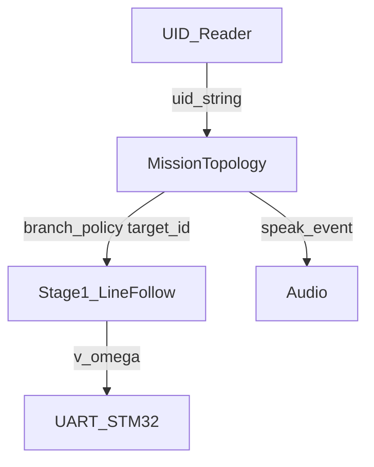
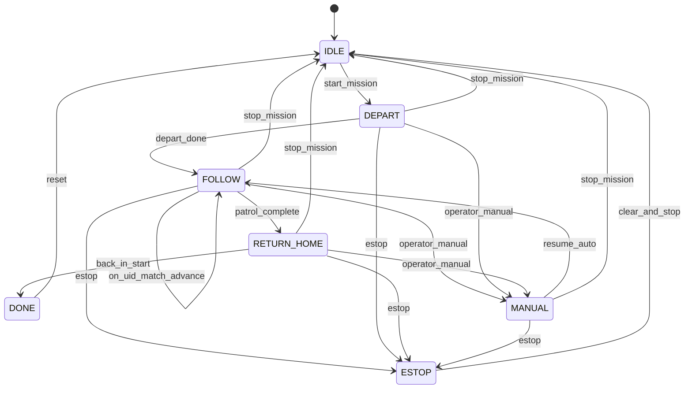

# 任务拓扑策略与 GUI 展示设计

杭州侦察机器人（公共安全赛项）上位机侧 **Mission / 拓扑任务层** 与 **调试 GUI 如何暴露该层状态** 的设计规格。目标是在不推翻 Stage-1 视觉寻线的前提下，说清楚「绕场顺序、出发选岔、UID 确认、回出发区」以及界面上要露出哪些真实字段。

> **当前约定修正：** 本文早期用 `P1`～`P12` 同时表示物理位置和播报点号，容易混淆。当前实现应以 [拓扑定位、RFID 到点与路口转向](../../reference/navigation/topology-rfid-navigation.md) 和 `config/nav_topology.yaml` 的行列节点为准：固定物理位置使用 `slot_id`，现场标签内容使用 `card_number`，两者不得写死相等。有标签节点读卡后停车并按拓扑方向原地转 90°；无标签路口继续使用视觉与里程计交接。本文下面的 `P1`～`P12` 只保留为早期任务顺序示意，不作为运行时定位 ID。

本文是设计稿，**不包含业务代码实现**。几何寻线细节以 Stage-1 规格为准，本文只定义与之的接口边界。

## Contents

- [背景与约束](#背景与约束)
- [目标与非目标](#目标与非目标)
- [分层与边界](#分层与边界)
- [拓扑模型](#拓扑模型)
- [配置草案](#配置草案)
- [状态机](#状态机)
- [对外接口](#对外接口)
- [UID 与语音契约](#uid-与语音契约)
- [GUI 优化设计](#gui-优化设计)
- [分阶段落地路线图](#分阶段落地路线图)
- [与现有工作的关系](#与现有工作的关系)
- [待确认项](#待确认项)
- [参考](#参考)

## 背景与约束

赛题要点（摘自 2026《侦查机器人》规则与图 3）：

- 从出发区进入场地后 **自主选择行进方向**，巡视图中 **1–12 号巡逻点**。
- 各巡逻点下方贴有 **UID 标签**；读卡器检测到对应标签时语音播报（如「到达 X 号巡逻点」），正确 **+10 分/处**，错误 **-10 分/处**，每点只计一次。
- 另有 8 个涵洞侦查点、4 段隧道、3 个障碍物与返回出发区等任务；其中障碍重规划、涵洞识别不在本文展开实现，但拓扑接口需能扩展。
- 参赛机器人允许使用 **1 个读卡器**（常见落地为 PN532 + 13.56 MHz NFC，正式卡型以组委会为准）。

仓库现状（与本文相关）：

- Stage-1 寻线规格已明确 **不做** 12 点拓扑与强制左右分支（见 `2026-08-29-visual-nav-road-follow-design.md`）。
- GUI（`gui/`）已具备双路预览、逻辑摄像头映射、V4L2 调参、道路分割拍照；任务 / 运行 / 状态页多为占位。
- UART、YOLO-seg、UID、语音等尚未接入 GUI 实链路。

## 目标与非目标

**目标**

1. 定义可配置的场地拓扑与默认 **逆时针** 巡逻点序：`出发区 → P1…P12 → 回出发区`。
2. 定义 Mission 状态机、路口选边策略（含出发区第一岔）、以及与 UID / 语音的计分契约。
3. 定义语言无关的 `MissionStrategy` 接口，供日后 Python 原型或 C++ 状态机实现。
4. 规定现有六页 GUI + 底栏应展示 / 可调试的策略字段，以及未接入时的真实空态文案。
5. 给出与 Stage-1、数据采集可并行的落地顺序。

**非目标（本文不设计细节）**

- road mask、IPM、Pure Pursuit 参数（属 Stage-1）。
- 障碍物占用栅格与重规划算法（只预留「边不可用 → 换路径」扩展点）。
- 涵洞内粘贴物 / 嫌疑人检测与播报文案细则。
- 人脸识别（arcface-lite）任务编排。
- PN532 驱动、引脚与供电（只约定「读到 UID 字符串」事件）。
- 改写现有 GUI 代码或新增顶栏「拓扑」页。

## 分层与边界

三层分工固定如下，避免与 Stage-1「交叉口自然延伸、不做强制选岔」冲突：Mission 负责选岔，Stage-1 负责贴路执行被选中的那条中心线。



| 层 | 回答的问题 | 主要输出 |
| --- | --- | --- |
| Mission / 拓扑 | 下一站是几号？本岔口走左/右/直？是否已计分？ | `target_id`、`branch_policy`、`speak_event`、`snapshot` |
| Stage-1 寻线 | 路在哪？怎么贴中心开？ | `(v, ω)`；在岔口消费 `branch_policy` 选择候选中心线 |
| UART / 下位机 | 轮子怎么转？ | 50 Hz `CMD_VEL` |
| UID 读卡 | 地面标签原始号是什么？ | `uid_string` 事件 |
| Audio | 播什么？ | 预录或 TTS 播放请求 |

**与 Stage-1 的衔接约定**

- Stage-1 在 **未收到有效 `branch_policy` 或策略层未启动** 时，保持现有行为：视野内道路自然延伸。
- 策略层启动后，几何层在检测到 **多条中心线分支** 时必须按 `LEFT | RIGHT | STRAIGHT` 选择一条；单分支时忽略 policy。
- `state` 模块（架构概览中的任务状态机）仲裁：**手动遥控优先于 Mission 自主**；急停立即零速并冻结 Mission 推进（见状态机）。

## 拓扑模型

对照赛题图 3，采用 **先验拓扑图**（不是比赛中的 SLAM 建图）：节点 + 边描述连通，不要求厘米级全局坐标。

### 节点

| 节点 ID | 含义 | UID |
| --- | --- | --- |
| `S` | 出发区 | 无 |
| `P1` … `P12` | 巡逻任务点 | 有（赛场粘贴） |
| `J_*`（可选） | 无名但必须决策的路口 | 无；用于填写 `junctions` 表 |

涵洞侦查点、隧道口若需要单独决策，可后续增补为 `C1…` / `T1…` 节点；第一版可不入库，仅在 GUI「任务」页保留计数占位。

### 边

有向或双向车道段，例如 `S→J_start`、`J_start→P1`、`P5→P6`。可选属性：

- `tunnel: bool` — 是否隧道段（无灯光，感知策略另议）
- `bidirectional: bool` — 默认可按场地标双向或单向（TBD）
- `blocked: bool` — 运行时由障碍逻辑置位（扩展用）

### 默认绕行（逆时针）

放车约定：**车头朝场地入口正前方（朝图内）**。  
逆时针时，入口左侧为 `P1`、右侧为 `P12`，故出发后第一岔偏好 **LEFT**（朝 `P1`）。

主环路径：

```text
S → P1 → P2 → P3 → P4 → P5 → P6 → P7 → P8 → P9 → P10 → P11 → P12 → S
```

顺时针为配置镜像（`direction: cw`，`start_bias: RIGHT`，点序反转），第一版实现可只保证 ccw，cw 留配置位。

示意（非精确几何）：

```text
                 [S 出发区]
                    |  |
                 P1-+  +-P12
                 |         |
                 P2        P11
                 |         |
                 P3        P10
                 |         |
                 P4        P9
                 |         |
                 P5--P6--P7--P8
```

## 配置草案

建议以 YAML（或等价 JSON）描述一场 mission profile，供「切换」页的测试1/2/3/正式任务绑定不同文件名。

```yaml
# 示例：profiles/official_ccw.yaml
name: official_ccw
direction: ccw                    # ccw | cw
patrol_order: [1, 2, 3, 4, 5, 6, 7, 8, 9, 10, 11, 12]

depart:
  pose_assumption: nose_into_field
  start_bias: LEFT                # ccw 默认；cw 时用 RIGHT

# 仅在「会选错岔」的节点填写；直道可省略（默认 STRAIGHT）
junctions:
  start_exit: LEFT                # 出发区出口第一岔 → 朝 P1
  # after_p5: STRAIGHT            # 场测补
  # to_start: RIGHT               # P12 之后回 S，场测补

uid_map:
  # 赛前标定：标签 UID 字符串 → 巡逻点号
  # "04A1B2C3": 1
  # "04D4E5F6": 2

# 测试任务可裁剪点序，例如只跑前 3 点
# patrol_order: [1, 2, 3]
```

**配置校验（实现时）**

- `patrol_order` 元素 ∈ `[1,12]`，无重复。
- `uid_map` 的值必须出现在 `patrol_order` 中（允许尚未录入全部卡号，未录入则该点只能靠调试注入）。
- `start_bias` / `junctions` 取值仅 `LEFT | RIGHT | STRAIGHT`。

## 状态机



| 状态 | 含义 | `branch_policy` 来源 |
| --- | --- | --- |
| `IDLE` | 未开始；不向寻线强制选岔 | 无（Stage-1 自然延伸或停车） |
| `DEPART` | 已 start，正在执行出发偏置 | `depart.start_bias` |
| `FOLLOW` | 沿主环前往 `target_id` | 默认 `STRAIGHT`；若当前逻辑路口命中 `junctions` 表则用表值 |
| `RETURN_HOME` | 12 点（或裁剪点序）完成，驶回 `S` | `junctions.to_start` 或 TBD 场测值 |
| `DONE` | 认为已回出发区 / 任务结束 | 无；`(v,ω)=0` |
| `MANUAL` | 操作者接管；Mission **冻结** `target_id` / visited | 不输出自主 policy |
| `ESTOP` | 软件急停；零速；冻结推进 | 无 |

**说明**

- `AT_JUNCTION` 不单独作为必须状态：可用「几何层报告多分支 + 当前 policy」在 `FOLLOW` 内完成选岔，降低状态爆炸。若实现时需要滞回，可加内部子标志 `multi_branch_active`，不必暴露给 GUI。
- `ARRIVED_UID` 作为 **瞬时事件处理**（在 `on_uid` 内完成播报与 `target_id` 推进），不占用稳态。
- 「已回到出发区」的判定第一版可为：操作者确认 / 超时停车 / 简易位姿启发式（TBD）；GUI 提供「确认返回出发区」调试按钮作为保底。

## 对外接口

语言无关的逻辑接口（日后 Python 单测或 C++ 实现均应对齐）：

```text
reset(profile) -> void
start() -> void
stop() -> void
estop() -> void
set_manual(active: bool) -> void

on_uid(uid_string: str) -> OnUidResult
  # OnUidResult: { accepted: bool, point_id: int|null, speak: str|null, score_delta: int }

get_target_id() -> int|null          # 1..12；RETURN_HOME/DONE 时为 null 或约定哨兵
get_branch_policy() -> LEFT|RIGHT|STRAIGHT|null
get_mission_snapshot() -> MissionSnapshot
```

`MissionSnapshot`（供 GUI 只读绑定）建议字段：

```text
profile_name: str
direction: ccw|cw
mode: IDLE|DEPART|FOLLOW|RETURN_HOME|DONE|MANUAL|ESTOP
target_id: int|null
visited: list[bool]                 # 长度 12，或 map point_id -> bool
visited_count: int
patrol_total: int                   # len(patrol_order)
branch_policy: LEFT|RIGHT|STRAIGHT|null
last_uid: str|null
last_uid_point_id: int|null
last_speak: str|null
last_score_delta: int               # 最近一次 on_uid 的得分变化，可为 0
mission_elapsed_s: float|null
notes: str                          # 人类可读短状态，如「等待 UID 映射录入」
```

计分只在 `on_uid` 内产生 `score_delta`，GUI **不得**自行因显示刷新再加分。

## UID 与语音契约

### 读卡事件

1. 驱动层读到标签，上报规范化字符串（建议大写十六进制、无冒号或统一冒号格式，实现时二选一并写进模块文档）。
2. `uid_map` 查表得 `point_id`；查不到 → `accepted=false`，打日志，不播报计分。
3. 若 `point_id == target_id` 且 `visited[point_id]==false`：
   - `visited=true`
   - `speak = "到达{point_id}号巡逻点"`（具体文案可配置）
   - `score_delta = +10`（与规则一致；若规则变更只改此处）
   - `target_id = next(patrol_order)`；若无下一个 → 进入 `RETURN_HOME`
4. 若 `point_id != target_id`：
   - **默认不播报、不计分、不改 target**（避免错序乱跳）
   - 可选调试模式：记录 `wrong_order_uid` 供状态页显示
5. 若已 `visited[point_id]`：忽略（保证每点一次）

规则中的「错误播报 -10」对应 **主动播错内容**（例如认错点号）。本契约通过「错序不播报」降低误扣风险；若日后做强制播报策略，必须在 `on_uid` 内显式产生 `score_delta=-10`，仍禁止 GUI 双重计数。

### 语音

- Mission 只产出 `speak_event`（字符串或预录 key），由 `audio` 模块播放。
- GUI「状态」页显示 `last_speak`；不在 GUI 线程直接操作声卡以外的第二套播报逻辑。

## GUI 优化设计

不改变 [`gui/README.md`](../../../gui/README.md) 的四区布局与六个顶栏页结构，**不新增**「拓扑」顶栏页。策略信息并入现有「运行 / 任务 / 状态 / 调参 / 底栏」。

### 原则

1. 继续使用逻辑摄像头映射与现有状态控件扩展字段。
2. 未接入的模块显示真实空态：`未连接` / `未加载` / `策略未启动`，**禁止**用假 UID、假速度装成已联调。
3. 所有策略数字来自 `get_mission_snapshot()`（或尚未实现时的明确占位绑定层），单一数据源。
4. Mock 仅允许出现在「调参」页的显式调试控件（例如注入 UID），并在 UI 上标注「调试」。

### 各页字段

| 页面 | 策略相关展示 / 操作 | 空态文案示例 |
| --- | --- | --- |
| 切换 | 测试1 / 测试2 / 测试3 / 正式任务各自绑定 `profile` 名（如 `test_first3`、`official_ccw`）；选中后只切换配置名，不自动 `start` | 配置文件缺失时提示「mission 配置未找到」 |
| 运行 | 开始 → `start()`；停止 → `stop()`；急停 → `estop()`。只读：`mode`、`target_id`、`direction`、`visited_count/patrol_total`、`mission_elapsed_s` | 控制接口未接入时保持现有「未接入」提示；策略未实现时 `mode=未加载` |
| 任务 | 12 点 checklist：待访 / 当前 / 已访；当前点高亮；可选显示该点已标定 UID 原文。涵洞 8 / 隧道 4 / 障碍 3 仍为规模占位 + 计数 TBD | 「UID 未接入」「侦查/隧道逻辑未加载」 |
| 状态 | `branch_policy`、规划/mission `mode`、`last_uid`、`last_speak`、`last_score_delta`；与摄像头 / STM32 / RKNN / 道路分割状态并列 | 各子项独立空态 |
| 调参 | 可选：运行时覆盖 `direction`（ccw/cw，需 `IDLE`）；**调试：注入 UID 字符串** 调用 `on_uid`；调试：确认已回出发区 | 注入按钮标注「调试」 |
| 底栏 | 增加摘要段：`目标Pn \| 已访 a/b \| policy`（与任务名、设备 FPS 并列） | `目标-- \| 已访 -/-- \| --` |

### 线框（策略相关增量）

```text
┌─────────────────────────────────────────────────────────────┐
│ 标题   [切换] [调参] [摄像机参数] [运行] [任务] [状态]        │
├─────────────────────────────────────────┬───────────────────┤
│ 识别摄像头          导航摄像头          │  右侧：任务 checklist │
│ （可叠加 mask/中心线，属 Stage-1）        │  P1 已访  P2 当前 … │
│                                         │  last_uid: …        │
├─────────────────────────────────────────┴───────────────────┤
│ 任务名 | 目标P3 | 已访 2/12 | LEFT | 识别FPS | 导航FPS | …   │
└─────────────────────────────────────────────────────────────┘
```

运行页逻辑关系：

```text
[开始] → Mission.start + 允许寻线自主
[停止] → Mission.stop  → IDLE，零速或保持手动通道策略（与 state 模块对齐）
[急停] → Mission.estop → ESTOP，立即零速
```

### Mock 与实模块边界

| 数据 | Mock 允许？ | 实模块来源 |
| --- | --- | --- |
| `visited` / `target_id` | 仅通过「注入 UID」间接触发 | `MissionStrategy` |
| `branch_policy` | 策略纯逻辑即可先真 | 同左；几何层稍后消费 |
| 相机画面 | 已是真 UVC | `gui` 采集线程 |
| STM32 速度 | 否 | `uart` |
| 道路分割状态 | 否 | RKNN / vision |
| UID 硬件 | 调参注入可代替 | PN532 线程 |

## 分阶段落地路线图

1. **纯逻辑**：配置加载 + `MissionStrategy` + 单测（点序推进、错序 UID、重复 UID、出发 bias）。无车、无 GUI 改动亦可。
2. **GUI 绑定**：`get_mission_snapshot()` → 运行 / 任务 / 状态 / 底栏；调参页注入 UID。
3. **UID + 语音**：PN532（或赛场同款读卡器）事件进 `on_uid`；`speak_event` → `audio`。
4. **接 Stage-1 选岔**：多分支中心线提取 + 消费 `branch_policy`；出发区场测校正 `junctions`。
5. **障碍改边**（更后）：边 `blocked` → 重算路径或插入绕行；更新 snapshot 供 GUI 显示「改线」。

并行提醒：采干净道路数据、标注、训练 YOLO-seg **不依赖** 本文落地；策略文档用于并行想清比赛流程与界面信息架构。

## 与现有工作的关系

| 已有产物 | 与本文关系 |
| --- | --- |
| `docs/superpowers/specs/2026-08-29-visual-nav-road-follow-design.md` | 几何层权威；本文在其上叠加 Mission |
| `vision/ipm_proto/` | 中心线原型；将来多分支选岔可在此演进 |
| `gui/` + `data/road/` | GUI 按本文扩展字段；道路拍照继续服务分割训练 |
| `uart/` | 只接收最终 `(v,ω)`；不直接解析拓扑 |
| 赛题 PDF 图 3 | 节点编号与 UID 巡逻语义的来源 |

## 待确认项

| 项 | 影响 | 向谁确认 |
| --- | --- | --- |
| UID 标签卡型 / 频率 / 是否可改写 | 读卡器选型与 `uid_map` 采集方式 | 组委会 / QQ 群 / 领队会 |
| 正式赛是否允许任选 cw 或必须统一 | 默认只实现 ccw 是否够用 | 规则答疑 |
| 出发区标准放置朝向与「入口」定义 | `start_bias` 左右是否反号 | 场地适应日 |
| 测试1/2/3 的官方或队内切分 | 「切换」页绑定哪些 profile | 队内约定 |
| 「回到出发区」自动判定条件 | `RETURN_HOME → DONE` | 队内 + 场测 |
| 错序读到 UID 是否必须语音（风险 -10） | `on_uid` 失败分支 | 规则答疑 |
| 隧道边是否要在第一版拓扑中显式建模 | `junctions` / 边属性工作量 | 队内 |

## 参考

- 赛题：`杭州侦察机器人.pdf` — 图 3、规则步骤（巡逻 UID、自主选择方向、播报得分）、§2.3 读卡器。
- Stage-1：`docs/superpowers/specs/2026-08-29-visual-nav-road-follow-design.md`
- GUI 现状：`gui/README.md`
- 架构：`docs/architecture/overview.md`（`state` / `navigation` / `uart` / `audio` 模块定位）
